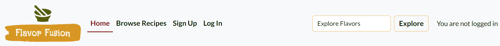
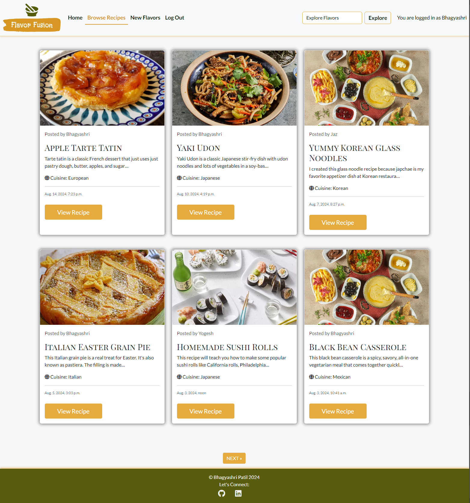
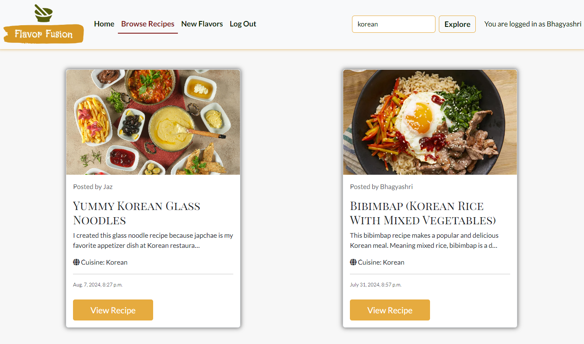
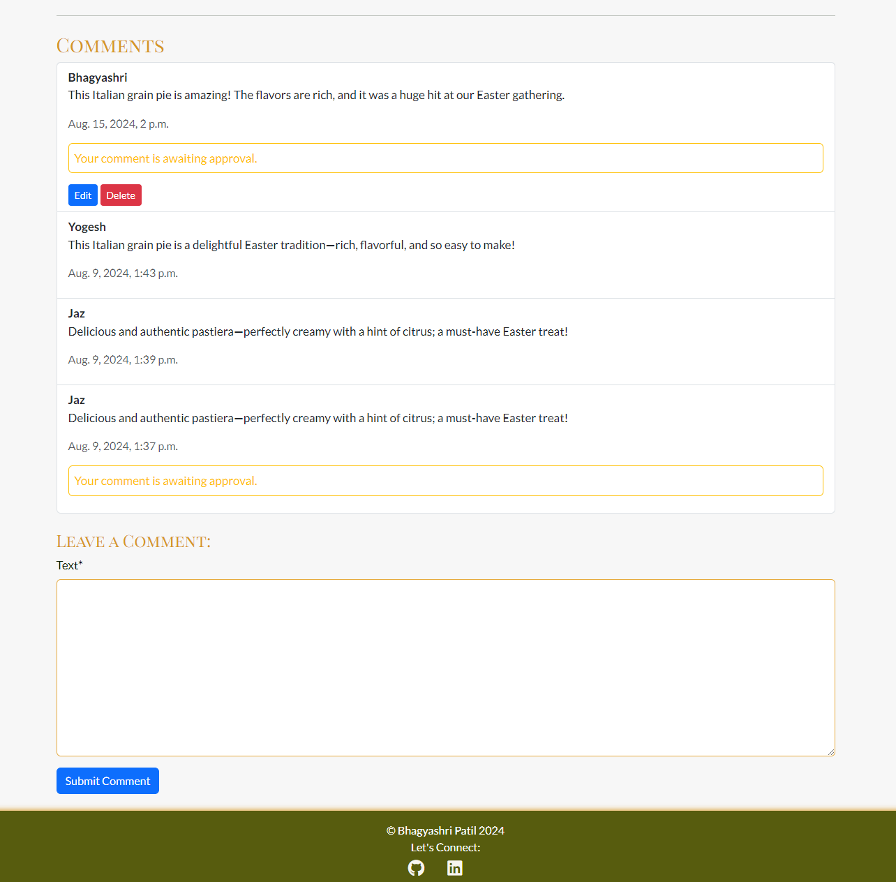
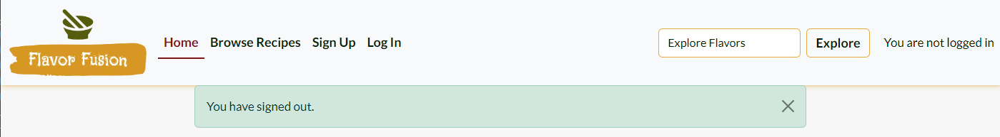
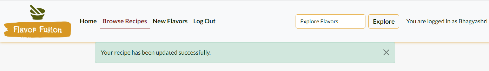
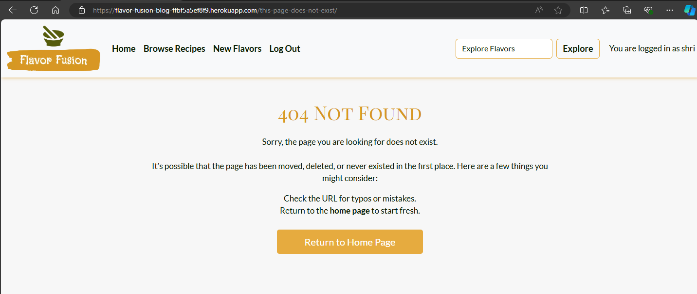

# Flavor Fusion
Flavor Fusion is a web application where food lovers can find, share, and explore recipes. It provides a user-friendly platform that is easy to navigate and visually appealing. Whether you're an experienced cook or just starting, Flavor Fusion lets you discover dishes from around the world, share your own recipes, and connect with other food enthusiasts.

The application provides several key features, including user authentication, full CRUD functionality for managing recipes, and an interactive community experience where users can like, comment on, and share recipes. Administrators also have a special dashboard to manage user content, making sure recipes and comments are appropriate and high-quality.

Flavor Fusion is built using modern web technologies, including HTML, CSS, and Python with the Django framework. The project was developed as a Portfolio Project for the Code Institute's Full Stack Software Development Course, showcasing the integration of front-end and back-end technologies to create a dynamic and user-friendly web application.


Deployed website:
 <a href="https://flavor-fusion-blog-ffbf5a5ef8f9.herokuapp.com/" target="_blank">Link to website</a>
<br>

---

# Table of Contents

- [Introduction](#introduction)
    - [Project Overview](#project-overview)
    - [Objectives](#objectives)
    - [Developer Goals](#developer-goals)
    - [User Goals](#user-goals)
- [Learning Outcomes and Skill Development](#learning-outcomes-and-skill-development)
- [System Architecture](#system-architecture)
    - [Application Structure](#application-structure)
    - [Backend Logic](#backend-logic)
    - [Programming Paradigms](#programming-paradigms)
- [Agile Development Process](#agile-development-process)
    - [Agile Planning](#agile-planning)
      - [User Stories and Management](#user-stories-and-management)
      - [Milestones Overview](#milestones-overview)
- [Data Modeling and Database Design](#data-modeling-and-database-design)
    - [Entity-Relationship Diagram (ERD)](#entity-relationship-diagram-erd)
    - [Database Schema](#database-schema)
- [Features](#features)
    - [Current Features](#current-features)
        - [CRUD Functionality](#CRUD-functionality)
    - [Future Features](#future-features)
- [User Experience Design](#user-experience-design)
    - [Strategy](#strategy)
    - [Scope](#scope)
    - [Structure](#structure)
    - [Skeleton](#skeleton)
- [Frontend Design](#frontend-design)
    - [Wireframes](#wireframes)
    - [Color Scheme](#color-scheme)
    - [Typography](#typography)
    - [Imagery](#imagery)
    - [Accessibility Features](#accessibility-features)
    - [Responsiveness](#responsiveness)   
- [Testing](#testing)
- [Deployment](#deployment)
    - <a href="#prerequisites">Prerequisites</a>
    - <a href="#heroku-deployment">Heroku Deployment</a>
    - <a href="#local-deployment">Local Deployment</a>
        - [How to Fork](#how-to-fork)
        - [How to clone](#how-to-clone)
        - [Setting up your local environment](#setting-up-your-local-environment)
- [Technologies Used](#technologies-used)
    - [Programming Languages](#programming-languages)
    - [Frameworks and Libraries](#frameworks-and-libraries)
    - [Database](#database)
    - <a href="#tools-services">Tools and Services</a>
- [Credits and Acknowledgements](#credits-and-acknowledgements)
    - [Code](#code)
    - [Media](#media)
    - [Content](#content)
    - [Acknowledgements](#acknowledgements)
---

## Introduction

Flavor Fusion is a web application designed for food enthusiasts to discover, share, and explore a wide variety of recipes. The platform offers a simple and user-friendly interface, making it easy for users to engage with the content and connect with other food lovers.

### Project Overview

Flavor Fusion is a Full-Stack application that provides users with a space to find recipes from around the world, share their own culinary creations, and interact with a community of like-minded individuals. The application includes features such as user authentication, full CRUD (Create, Read, Update, Delete) functionality for managing recipes, and an interactive community experience. An admin dashboard is also available for administrators to monitor and manage user-generated content.

*<span style="color: blue;">[Back to Content](#table-of-contents)</span>*   

### Objectives

- Create a platform that allows users to easily browse, share, and discover recipes.
- Build a community where users can interact by liking and commenting on recipes.
- Ensure a smooth user experience with a clean and intuitive interface.
- Provide tools for administrators to manage content and maintain the quality of the platform.

*<span style="color: blue;">[Back to Content](#table-of-contents)</span>*   

### Developer Goals

As developers, the primary goal is to build a robust and scalable web application using the Django framework. This project highlights their skills in Full-Stack development, focusing on:
- **User Authentication:** Implement user authentication and secure account management.
- **CRUD Functionality:** Develop full CRUD functionality for recipe management.
- **Responsive Design:** Create an interactive and responsive user interface using modern web technologies.
- **Admin Dashboard:** Build an admin dashboard for monitoring and managing user content.
- **Scalability and Maintenance:** Ensure the application is scalable and easy to maintain.

*<span style="color: blue;">[Back to Content](#table-of-contents)</span>*   

### User Goals

Flavor Fusion aims to provide a reliable and easy-to-use platform for cooking and sharing recipes. It is designed for food lovers who want a simple and enjoyable way to:
- Find and explore a wide variety of recipes from different cuisines.
- Share their own recipes and culinary creations with others.
- Like and comment on recipes to interact with the community.
- Enjoy a smooth and visually appealing browsing experience.
- Trust that the platform offers high-quality and well-managed content.

*<span style="color: blue;">[Back to Content](#table-of-contents)</span>*   

## Learning Outcomes and Skill Development
The main goal of this project is to improve my web development skills by using the Django framework in a practical setting. The specific learning objectives are:

- **Full-Stack Development:** Learn how to build a complete web application from start to finish.
- **Front-End Skills:** Improve my ability to create a user-friendly and responsive interface.
- **Back-End Development:** Strengthen my skills in managing databases, handling user authentication, and writing server-side code.
- **Agile Methodology:** Use Agile development practices to stay flexible and adapt to feedback and changing needs.
- **Practical Experience:** Gain hands-on experience that will help in future web development projects.

This project is meant to meet the course requirements and help build a strong foundation for future work in web development.

*<span style="color: blue;">[Back to Content](#table-of-contents)</span>*

## System Architecture

### Application Structure
Flavor Fusion is designed using the Model-View-Controller (MVC) pattern, which divides the application into three key components: Model, View, and Controller. This structure helps organize the code, making development and collaboration more manageable.

The frontend is created using HTML, CSS, and JavaScript, with a focus on a mobile-first, responsive design. Bootstrap is utilized for its extensive library of pre-styled components and a responsive grid system, which speeds up development and ensures a smooth user experience on all devices.

The backend is powered by Python and Django. Django handles the backend logic, URL routing, and database interactions, providing a solid and efficient foundation for the application.

For data storage, the project uses a relational database, PostgreSQL, known for its robustness and scalability. The database stores user and recipe information in a structured manner, which optimizes data retrieval and supports complex queries efficiently.

*<span style="color: blue;">[Back to Content](#table-of-contents)</span>*   


### Backend Logic
Flavor Fusion uses models such as `Recipe`, `Comment`, and `CuisineType`. Each `Recipe` is linked to a `CuisineType` and can have multiple Comments. Each `Comment` is tied to a specific `Recipe` and `User`.

Django views handle all the main functions like creating, updating, reading, and deleting recipes and comments. User login and roles are managed using Django's built-in authentication, which keeps the system secure.

The backend also supports features like liking recipes and approving comments. Tools like Cloudinary manage recipe images, and Summernote widgets are used for rich text editing of ingredients and instructions.

This setup ensures a secure, easy-to-use platform for sharing and managing recipes.

*<span style="color: blue;">[Back to Content](#table-of-contents)</span>*   

### Programming Paradigms

The application uses various programming paradigms to achieve its functionality:

**Object-Oriented Programming (OOP):** Models like Recipe and Comment use classes to represent and manage data. Django's views and forms also leverage OOP principles for reusability and organization.

**Functional Programming:** Some views are written as functions to handle specific tasks, processing inputs and returning responses.

**Declarative Programming:** The Django ORM and forms use a declarative style to define data structures and form fields, abstracting away complex query and presentation logic.

**Event-Driven Programming:** The app responds to user actions and requests, such as form submissions and comment postings, using a request-response model.

**MVC Pattern:** Django follows the Model-View-Controller (MVC) pattern, with Models handling data, Views managing user interactions, and Controllers (or view functions) processing requests and responses.

*<span style="color: blue;">[Back to Content](#table-of-contents)</span>*  

## Agile Development Process

### Agile Planning

For this project, I implemented an Agile methodology, organizing the entire process using a GitHub project board. This approach allowed me to manage the development from the initial planning stages to the final deployment. The project was divided into 10 milestones, each representing a key phase of the development process, ensuring that progress was systematic and aligned with the project’s goals.

You can view the full Project Board, complete with all user stories and progress tracking, here: <a href="https://github.com/users/bhagyashriyogeshpatil/projects/2" target="_blank">Github Project board</a>

<details><summary>User Story Template</summary>


</details>

<details><summary>Kanban Board</summary>


</details>

#### **User Stories and Management:**

- **Acceptance Criteria:** Each user story was developed with specific acceptance criteria to ensure clarity and focus. This approach guaranteed that every task met the necessary requirements before being marked as complete.

- **MoSCoW Prioritization:** To manage priorities effectively, features were categorized using the MoSCoW method - 'Must have', 'Should have'and 'Could have'. This prioritization ensured that the core features (MVP) were developed first, with secondary features added if time permitted.

#### **Milestones Overview:** 

1. **GitHub Repository Setup**

- This milestone involves creating the GitHub repository and setting up the README file. It’s about getting the project organized and ready for development.
    - User Story 1: Create GitHub Repository (Must Have)
    - User Story 26: Create README File (Must Have)

2. **Django Project Initialization**

- This step involves creating the initial Django project and configuring the basic settings. It establishes the groundwork for further development.
    - User Story 2: Initialize Django Project (Must Have)

3. **Deployment and Configuration**

- This milestone is about preparing the project for live deployment, including configuring settings, setting up the database, and deploying the project to Heroku.
    - User Story 3: Configure Deployment and Database (Must Have)
    - User Story 27: Final Deployment to Heroku (Must Have)
    - User Story 31: Deployment with Static Files (Must Have)

4. **User Authentication and Account Management**

- This milestone adds user authentication features, allowing secure user registration and login. It also includes styling the authentication pages for a better user experience.
    - User Story 10: Implement Django Allauth for User Registration and Authentication (Must Have)
    - User Story 11: User Registration and Authentication (Must Have)
    - User Story 24: Style Allauth Pages (Could Have)

5. **Basic Project Structure**

- Involves designing the core layout and user interface elements, such as the base template, static files, navigation menu, and footer.
    - User Story 4: Create Base Template (Must Have)
    - User Story 5: Add Static Files and Media (Must Have)
    - User Story 6: Create Navigation Menu (Must Have)  
    - User Story 7: Create Footer (Must Have)
    - User Story 23: Easy Navigation (Must Have)

6. **Website Content and Navigation**

- Focuses on building the main website pages and navigation features, including the home page, recipe browsing, detailed recipe views and explore recipes.
    - User Story 8: Home Page (Must Have)
    - User Story 9: Browse Recipes (Should Have)
    - User Story 16: View Detailed Recipes (Must Have)
    - User Story 21: View Paginated Recipe List (Should Have)
    - User Story 22: Explore Recipes (Should Have)

7. **Recipe Management**

- Implements the functionality for managing recipes, including creating, editing, deleting, and handling draft recipes. This helps maintain the quality and organization of content.
    - User Story 12: Create and Publish Recipes (Must Have)
    - User Story 13: Edit Shared Recipes (Must Have)
    - User Story 14: Delete Recipes (Must Have)
    - User Story 15: Manage Recipe Posts (Must Have)
    - User Story 33: Restrict Draft Recipe Access (Must Have)

8. **Recipe Interaction**

- Adds interactive features for recipes, including commenting, viewing comments, liking recipes, and adding a comment count on recipe details.
    - User Story 17: Comment on Recipes (Should Have)
    - User Story 18: View Comments on Recipe Posts (Should Have)
    - User Story 19: Modify or Delete Comments (Could Have)
    - User Story 20: Approve or Disapprove Comments (Should Have)
    - User Story 25: Interact with Recipe Likes (Could Have)
    - User Story 32: Add Comment Count with Icon on Recipe Detail (Could Have)

9. **Final Touches**

- This milestone focuses on refining the user experience, ensuring easy and intuitive navigation throughout the website. It completes the overall structure and usability of the project.
    - User Story 23: Easy Navigation (Must Have)

10. **Error Handling**

- Ensures the site handles errors effectively with custom error pages and notifications for issues like 403, 404 and 500 errors.
    - User Story 28: Access 403 Error Handling (Should Have)
    - User Story 29: Custom 404 Page for Broken Links (Should Have)
    - User Story 30: Notification of Internal Errors (Should Have)

*<span style="color: blue;">[Back to Content](#table-of-contents)</span>*  

## Data Modeling and Database Design

### Entity-Relationship Diagram (ERD)

The Entity-Relationship Diagram (ERD) provides a visual representation of the database's structure. It helps in planning and illustrating the SQL tables and the relationships between them. The ERD is an essential part of the database design that shows the entities, their attributes, and the types of relationships among the entities.

The ER diagram was created with [dbdiagram.io](https://dbdiagram.io/home)
to show how the models in the app are structured and related.


*<span style="color: blue;">[Back to Content](#table-of-contents)</span>*   

### Database Schema

The database schema is designed to efficiently manage and store data related to recipes, comments, and user interactions within the application.

The ER diagram was created with [dbdiagram.io](https://dbdiagram.io/home)
to show how the models in the app are structured and related. The Recipe model has all the key fields like title, ingredients, and instructions needed for a complete recipe. This design makes sure the website works well and gives users a great experience.

The ER diagram showcases the relationships between the Recipe model, Comment model, CuisineType model and Django's built-in User model (user_django_built_in_model) as follows:

- **User to Recipe: One-to-Many (1:M)**
    - Each user can create multiple recipes.
    - Each recipe is associated with one user.
- **Recipe to Comment: One-to-Many (1:M)**
    - Each recipe can have multiple comments.
    - Each comment is associated with one recipe.
- **User to Comment: One-to-Many (1:M)**
    - Each user can make multiple comments.
    - Each comment is associated with one user.
- **CuisineType to Recipe: One-to-Many (1:M)**:
    - Each cuisine type can be associated with multiple recipes.
    - Each recipe is associated with one cuisine type.

**Summary of Relationships:**
- **User to Recipe (1:M):**
A user can create multiple recipes, but each recipe is created by one user.
- **Recipe to Comment (1:M):**
A recipe can have multiple comments, but each comment is tied to a single recipe.
- **User to Comment (1:M):**
A user can make multiple comments, but each comment is made by a single user.
- **CuisineType to Recipe (1:M)**:
  A cuisine type can have multiple recipes, but each recipe is associated with only one cuisine type.

These relationships were implemented using ForeignKey fields in the Django models:
- The `Recipe` model includes a `ForeignKey` field (`author`) that references the `User` model to denote the creator of the recipe.
- The `Comment` model includes `ForeignKey` fields (`recipe` and `author`) that reference the `Recipe` and `User` models respectively, indicating the recipe being commented on and the user making the comment.
- The `Recipe` model includes a `ForeignKey` field (`cuisine_type`) that references the `CuisineType` model to denote the type of cuisine for the recipe.

Additionally, a many-to-many relationship is established between the `Recipe` model and the `User` model to facilitate the "likes" feature, where users can like multiple recipes.

The `likes` feature is implemented as a **many-to-many(M:M)** relationship between the `Recipe` and `User` models using Django's `ManyToManyField`. Although Django automatically creates a join table for this, it’s not explicitly shown in the ER diagram.

In the dbdiagram.io code, this relationship is represented directly between the Recipe and user_django_built_in_model tables using the following reference:

```
// The many-to-many relationship between Recipe and user_django_built_in_model for likes

Ref: recipe.id < user_django_built_in_model.id [label: "likes", note: "Many-to-Many relationship"]
```
In the dbdiagram.io code, this relationship is represented by a reference label, though the details may not appear directly in the visual diagram, keeping the design clean and focused.

*<span style="color: blue;">[Back to Content](#table-of-contents)</span>*   

## Features

### Current Features

#### **Navigation Menu**
The navigation bar adapts based on user login status and is fully responsive for both desktop and mobile devices.

The navigation bar is visible on every page, depending on whether the user is logged in. It adjusts to different screen sizes, turning into a hamburger menu on smaller screens for easy access. When a user logs in or registers, a success message is shown.

- As a developer, I want to create a navigation menu in the base template so that users can easily navigate through the website's pages. **(User Story#6) (must have)**
- As a User, I can navigate between pages easily so that I can explore the website content without any confusion. **(User Story#23) (must have)**

##### **Navigation Bar for All Users (desktop/mobile)**
- Home: Always available.
- Browse Recipes: Accessible to all users.
- Sign Up: Shown to non-authenticated users.
- Log In: Available for non-authenticated users.
- Explore: Search feature available for all users.




##### **Navigation Bar for Authorized Users (desktop/mobile)**
- Home: Always accessible.
- Browse Recipes: Same as for all users.
- New Flavors: Only for logged-in users.
- Log Out: Available for authenticated users.
- Explore: Search feature available for all users.


##### **User Authentication Status**

A message indicating the user's login status is displayed in the nav bar:
- Logged In: "You are logged in as [username]"
- Not Logged In: "You are not logged in"

*<span style="color: blue;">[Back to Content](#table-of-contents)</span>*   

#### **Home Page**

The home page is designed to be welcoming and informative, clearly showing what the Flavor Fusion website is about. It gives users a preview of what to expect and invites them to explore more. The background image is carefully chosen to match the recipe theme and enhance the site's visual appeal. 

For users who are not logged in, a "Sign Up Now" button is displayed on the home page. This button appears only if the user is not authenticated, encouraging new visitors to sign up for an account.

- As a visitor, I want to see an engaging home page so that I can understand what the recipe blog offers. **(User Story#8) (must have)**

##### Home Page for All Users


##### Home Page for Authorised Users


*<span style="color: blue;">[Back to Content](#table-of-contents)</span>*   

#### **Footer**
The footer of the Flavor Fusion website provides key information and links for users to connect with the developer.

Like the navigation bar, the footer appears on every page of the website. It includes icons linking to GitHub and LinkedIn. These links let users view my work on GitHub and learn more about me on LinkedIn. Both links open in new tabs.

- As a developer, I want to create a footer so that users can access social media links and see information about the developer and the website creation year at the bottom of every page. **(User Story#7) (must have)**


*<span style="color: blue;">[Back to Content](#table-of-contents)</span>*   

#### **Sign Up / Log In / Log Out**
The navigation bar allows access to all pages, whether on large or small screens.

Users can easily find and use the sign-up and log-in options to fully explore the website's features. Clear messages are displayed to guide users on whether they need to sign up or log in to view recipes, like, comment, or add New Flavors.

Success messages are shown to users after they sign up, log in, or log out.

- As a developer, I need to set up Django Allauth so that users can register, sign in, and access additional features on the website. **(User Story#10) (must have)**

- As a Site User, I can register an account so that I can access publishing, commenting, and like/unlike features. **(User Story#11) (must have)**

- As a developer, I want to style the allauth authentication pages - signup, login, and logout; so that users have a consistent experience.. **(User Story#24) (could have)**
##### Sign Up Page View


##### Log In Page View


##### Log Out Page View


*<span style="color: blue;">[Back to Content](#table-of-contents)</span>*   

#### **New Flavor Page**

The New Flavor page allows users to submit a new flavor to the application. The link to this page is only visible to users who are logged in. When clicked, it takes them to a form where they can enter details about the new flavor.

- Required Fields: 
  - All fields, except for the optional image upload, must be filled out.
  - If any required fields are left empty, error messages will appear below those fields.

- Image Upload: 
  - Users can upload an image for the flavor, but it's not required.
  - If no image is provided, a default image will be used.

- Submission and Feedback: 
  - After submitting the form, users will see a success message.
  - They will be redirected to the page displaying all flavors.

- User-Friendly Design: 
  - The form is styled with Crispy Forms and Bootstrap.
  - This makes the form clean and easy to use.

- As a logged-in user, I can share delicious recipes with others so that creating and publishing recipes. **(User Story#12) (must have)**

##### New Flavor Page View


##### New Flavor Page View Mobile


*<span style="color: blue;">[Back to Content](#table-of-contents)</span>*   

#### **Edit Flavor**

The Edit Flavor page allows logged-in users to update their previously shared recipes. This page ensures that users can correct or modify recipe details as needed.

- Access Control:
    - Only the user who posted the recipe can see and use the "Edit" button.

- Pre-Populated Form:
    - The form is pre-filled with the existing recipe details, making it easy to update.

- Required Fields:
    - All fields, except for the optional image upload, must be filled out. Error messages will appear if any required fields are left empty.

- Image Upload:
    - Users can update the image, but it's not required.

- Submission and Feedback:
    - After clicking "Update Flavor", a confirmation message appears, and the user is redirected to the recipes page.

- User-Friendly Design:
    - The form uses Crispy Forms and Bootstrap for a clean and easy-to-use interface.

This page makes it simple for users to keep their recipes up to date.

- As a logged-in User, I can edit my shared recipes so that I can correct and update recipe details as needed. **(User Story#13) (must have)**

##### Edit Flavor button


##### Edit Flavor Page View


*<span style="color: blue;">[Back to Content](#table-of-contents)</span>*  

#### **Delete Flavor**

The Delete Flavor feature allows logged-in users to remove recipes they have previously created or shared. This functionality ensures users can manage their content by removing any outdated or unwanted recipes.

- Access Control:
    - The "Delete" button is visible only to the user who authored the recipe.

- Confirmation Page:
    - Users are directed to a confirmation page to verify their intention to delete the recipe.
    - On this page, users can either confirm the deletion or cancel the action.

- Deletion and Feedback:
    - If the user confirms the deletion, the recipe is permanently removed from the site.
    - A success message is displayed, and the user is redirected as appropriate.
    - If the user cancels the deletion, they are taken back to the recipe's detailed page.

- User-Friendly Design:
    - The confirmation page uses Bootstrap for a clean and user-friendly interface, making it easy to navigate and manage recipes.

- As a logged-in user, I can delete my previously created or shared recipes so that they are removed from the site and no longer visible to others. **(User Story#14) (must have)**

##### Delete Flavor Button


##### Confirm Deletion View


*<span style="color: blue;">[Back to Content](#table-of-contents)</span>*   

#### **Recipe Details**
The Recipe Details page allows users to view all the important information about a specific recipe. This page includes the recipe's title, author, ingredients, preparation and cooking times, and step-by-step instructions. Users can also interact with the recipe by liking it, leaving comments, and, if they are the author, editing or deleting it.

- Recipe Information:
    - Shows the recipe's title and the user who posted it.
    - Displays when the recipe was created.
    - Indicates the type of cuisine.
    - Lists the time needed to prepare and cook the recipe.
    - Shows the number of servings.
    - Provides a brief overview of the recipe.
    - Ingredients and Instructions: Details what you need and how to make the dish.

- Image Display:
    - If an image is uploaded, it will be displayed on the page.
    - A default image is shown if no image is provided.

- User Interactions and Design:
    - Logged-in users can like/unlike recipes, leave, edit, or delete comments, and the recipe's author can edit or delete their recipe. 
    - The page is designed to be responsive, looking good on both desktop and mobile devices.

The Recipe Details page is designed to be simple and user-friendly, providing all the necessary information and interactive options in a clear and accessible way.

- As a Site User, I can view and read detailed recipes shared by others so that I can get inspiration. **(User Story#16) (must have)**

##### Recipe Details View for Unauthorised Users


<details><summary>Recipe Details View for Unauthorised Users Mobile</summary>


</details>

##### Recipe Details View for Logged-in Users


<details><summary>Recipe Details View for Logged-in Users Mobile</summary>


</details>

##### Recipe Details View for Logged-in User and author of the recipe


<details><summary>Recipe Details View for Logged-in Users Mobile</summary>


</details>

*<span style="color: blue;">[Back to Content](#table-of-contents)</span>*   

#### **Browse Recipes Page** 
The Browse Recipes page is where users can explore all the available recipes on the site. It’s designed to be user-friendly, making it easy to find new dishes to try.

- Each recipe is shown as a card with an image, title, brief description, cuisine type, author, and posting date, giving users a quick overview.
- Recipes are displayed with a picture and a short description to help users quickly decide which ones they want to explore further.
- A button on each card links to a detailed recipe page with full ingredients and instructions.
- If no recipes match a search, a message is shown to suggest trying a different term.
-  The layout adapts to different devices, so it looks great on both desktop and mobile screens.
- Images are stored and loaded from Cloudinary for fast and reliable display.
- As a user, I want to explore various recipes so that I can find new dishes to try. **(User Story#9) (should have)**

##### Browse Recipes Page Desktop


<details><summary>Browse Recipes Page Mobile</summary>


</details>

*<span style="color: blue;">[Back to Content](#table-of-contents)</span>*  

#### **Recipe Pagination**
Recipe Pagination helps users navigate through multiple pages of recipes, making it easy to browse without overwhelming them with too much content at once.

- Users can move between pages using "Previous" and "Next" links at the bottom of the page.
- The system adjusts based on the number of recipes and the current page.
- Pagination controls work well on all devices, from desktops to mobile phones.
- Users can easily flip through pages to see all the recipes available.
- As a Site User, I can view a paginated list of recipe posts so that I can choose which recipes to read. **(User Story#21) (should have)**

##### Browse Recipe Pagination Next Page


##### Browse Recipe Pagination Prev Page


*<span style="color: blue;">[Back to Content](#table-of-contents)</span>*   

#### Explore Flavors
The Explore Flavors feature allows users to discover and explore a wide range of recipes based on various search criteria. This feature improves user experience by offering an easy-to-use search interface and showing results that match the user's search.

- The search bar is in the top navigation bar, making it easy to find and use on any page.
- Users can search for recipes by typing keywords from the title, description, author, or cuisine type.
- Search results show up as a list of recipes.
- If no recipes match the search, a message will inform the user that no results were found.
- If you don't search for anything, you'll see all available recipes on Browse Recipes page.
- If a recipe's status is set to Draft, it will not appear in the public search results or on the main recipes listing page. Only recipes with a status of Published are visible to users when they explore or search for recipes.

- As a Site User, I can explore recipes so that I can discover new and interesting dishes. **(User Story#22) (could have)**

#####





*<span style="color: blue;">[Back to Content](#table-of-contents)</span>*   

#### Comment Section
The Comments section lets users share their thoughts and interact with others on specific recipes. 
- Only users who are logged in can see and use the comment field.
- After submitting a comment, it goes to the admin for approval. Users are notified that their comment is awaiting approval.
-  Approved comments appear under the recipe, so everyone can see the discussion.
- If there are no comments, a message encourages users to be the first to comment.
- Users can edit or delete their own comments if they change their mind.
- Admins can approve or disapprove comments to keep discussions respectful.
- A comment icon is shown next to the comment count for each recipe. The icon and count are clearly visible and well-aligned. The count, labeled “comments,” immediately follows the icon and accurately reflects the number of comments on the recipe.
- As a Site User, I can leave comments on recipes so that I can interact with others and share my opinions. **(User Story#17) (should have)**
- As a Site User, I can view comments on an individual recipe post so that I can read the conversation. **(User Story#18) (should have)**
- As a Site Admin, I can approve or disapprove comments so that I can manage inappropriate content. **(User Story#20) (should have)**
- As a Site User, I can modify or delete my comments on a post so that I can participate in the conversation. **(User Story#19) (could have)**
- As a recipe viewer, I want to see a comment icon next to the comment count so that I can easily see how many comments are on a recipe **(User Story#32) (could have)**

##### Comments Section message encouraging users to join the conversation if no comments are present


##### Comments Section for authorised Users awaiting approval




##### Comments Section for authorised Users approved comment


##### Comments Section for authorised Users Update comment


##### Comments Section for unauthorised Users


##### Total Number of Comments


*<span style="color: blue;">[Back to Content](#table-of-contents)</span>*  

#### Recipe Like/Unlike Feature
 On the recipe detail page, users can like or unlike recipes.
- On the detailed recipe page, a heart icon is displayed to indicate the like/unlike functionality.
- Logged-in users can interact with the icon. Non-logged-in users see a disabled version.
- Logged-in Users can click the empty heart icon to add their like. The icon will turn into a filled heart, and the like count will go up.
- If you’re a logged-in user and have already liked the recipe, click the filled heart icon to unlike it. The icon will change back to an empty heart, and the like count will decrease.
- For non-logged-in users, the like button is disabled and cannot be used.
- As a logged-in User, I can like or unlike others' recipes so that I can interact with the content. **(User Story#25) (could have)**

##### Recipe Like/Unlike Feature for Unauthorised Users


##### Liked Recipe for Authorised Users


##### Unliked Recipe for Authorised Users


*<span style="color: blue;">[Back to Content](#table-of-contents)</span>* 

#### Admin Features
As a Site Admin, you have full control over managing recipes and comments on the blog.
- You can create, view, edit, and delete recipes. This includes managing both draft and published recipes, with drafts being visible only to you and the recipe author. 
- Unauthorized users who try to access drafts will see a 403 error page.
- You also have the ability to moderate comments. You can approve comments to make them visible on the site or disapprove them to keep inappropriate content hidden.
- Additionally, you are responsible for setting up the site, including creating a superuser account to manage everything efficiently.
- As a developer, I want to configure and deploy the recipe blog project so that I can ensure a smooth deployment process, test functionality, and create a superuser for efficient website management. **(User Story#3) (must have)**
- As a Site Admin, I can create, read, update, and delete recipe posts so that I can effectively manage my recipe blog content. **(User Story#15) (must have)**
- As a Site Admin, I can approve or disapprove comments so that I can manage inappropriate content. **(User Story#20) (should have)**
- As a recipe author or admin, I can restrict access to draft recipes so that only authorized users can view them. **(User Story#33) (must have)**


*<span style="color: blue;">[Back to Content](#table-of-contents)</span>*  

#### Draft Recipes Access Control
This feature allows recipe authors and administrators to control who can see recipes that are still in draft mode. Draft recipes have a status of 0 and are only visible to the author or admins. If someone who is not authorized tries to view a draft recipe, they will see a custom 403 error page.

- Only the recipe's author or an admin can view draft recipes (status = 0).
- Unauthorized users trying to access a draft recipe will be redirected to a 403 error page explaining they don’t have permission.
- This feature ensures that draft recipes remain private until the author decides to publish them.
- If you see a 403 error, it's because the recipe is still in draft mode and you don’t have the necessary permissions to view it.
- As a recipe author or admin, I can restrict access to draft recipes so that only authorized users can view them. **(User Story#33) (must have)**

##### Draft Recipe View for Author


##### Draft Recipe View for Admin


##### Draft Recipe View for Unauthorized Users


##### Draft Recipe Status in Admin Panel


*<span style="color: blue;">[Back to Content](#table-of-contents)</span>*  

#### User Feedback
This application provides clear feedback to users about their actions.
- Feedback messages, including success, error, and informational alerts, are shown at the top of the page and can be closed by users. 
- The base template includes a section to display these messages.
- Message will be displayed for :
    - User Sign Up / Log In / Log Out 
        - Message: "You have logged in successfully." / "You have signed up successfully." / "You have logged out successfully."
        - Displayed when: Login, sign-up, or logout is successful.
    - User Posted a Recipe 
        - Message: "Your recipe has been posted successfully."
        - Displayed when: A recipe is successfully added.
    - User Editing the Recipe 
        - Message: "Your recipe has been updated successfully."
        - Displayed when: A recipe is successfully updated.
    - User Deleting the Recipe 
        - Message: "Your recipe has been deleted successfully."
        - Displayed when: A recipe is successfully deleted.
    - User Submitting a Comment on a Recipe 
        - Message: "Your comment has been submitted and is awaiting approval."
        - Displayed when: A comment is successfully submitted.
    - User Editing a Comment 
        - Message: "Comment updated and awaiting approval."
        - Displayed when: A comment is successfully updated.
    - User Deleting a Comment 
        - Message: "Comment deleted successfully."
        - Displayed when: A comment is successfully deleted.
    - 403 Forbidden Error 
        - Message: "Sorry, you do not have permission to access this page."
        - Displayed when: Access to a page is denied due to permissions.
        - For draft recipes: "You do not have permission to view the recipe titled 'Recipe Title' because it is still in draft mode."
        - Displayed when: Access to a draft recipe is denied.







*<span style="color: blue;">[Back to Content](#table-of-contents)</span>*  

#### Error Pages
This project includes custom error pages that are designed to enhance user experience by providing clear and informative messages when an error occurs. The custom error pages are triggered in the following scenarios:

- 403 Forbidden - Unauthorized Access:
    - When users try to access content they don’t have permission to view, they are shown a 403 error page. It explains the situation and provides a link to return to the home page.
    - If the recipe is in draft mode and you don’t have access, the page will mention this specifically. A link is provided to return to the home page, so you can keep browsing the website.

- 404 Not Found - Page Not Found:
    - If users navigate to a page that doesn’t exist, they see a 404 error page. It tells them the page isn’t available and offers a link to the home page.

- 500 Internal Server Error:
    - In case of server issues, a 500 error page appears. It informs users that something went wrong on our end and includes a link to the home page.

Each error page is user-friendly and helps users easily find their way back to the home page.

- As a User, I want to be directed to a 403 error page when attempting to access content or functionality that I am not authorized to view, so that I am aware of my access limitations and can take appropriate action.  **(User Story#28) (should have)**
- As a recipe author or admin, I can restrict access to draft recipes so that only authorized users can view them.  **(User Story#33) (must have)**
- As a User, I want to be directed to a custom 404 page when I navigate to a broken link or URL that does not exist, so that I am informed that the page I am looking for is not available and can be directed to other relevant sections of the website.  **(User Story#29) (should have)**
- As a User, I want to be notified in case of an internal error so that I can understand what went wrong and how to proceed.  **(User Story#30) (should have)**

##### 403 Forbidden Error Page


##### Draft Recipe View for Unauthorized Users


##### 404 Not Found Page


##### 500 Internal Server Page


*<span style="color: blue;">[Back to Content](#table-of-contents)</span>*  

#### CRUD Functionality

#### Recipe Management: Full CRUD Functionality Overview
The application supports full CRUD (Create, Read, Update, Delete) functionality for managing recipes. Here’s an overview of each operation:

**Create:**
  - **New Flavor Page:** Allows users to submit new flavors to the application. The form includes required fields and an optional image upload. After submission, users receive feedback and are redirected to a page displaying all flavors.
  - [**New Flavor Page**](#new-flavor-page)

**Read:**
  - **Recipe Details Page:** Displays detailed information about a specific recipe. Users can view the recipe details but cannot modify or delete the recipe from this page.
  -	[**Recipe Details**](#recipe-details)

**Update:**
  - **Edit Flavor Page:** Allows users to update recipes they have previously shared. The form is pre-populated with existing details, and users receive feedback upon saving changes.
  - [**Edit Flavor**](#edit-flavor)

**Delete:**
  - **Delete Flavor Feature:** Allows users to remove recipes they have created or shared. Users must confirm their decision to delete, with feedback provided upon completion.
  - [**Delete Flavor**](#delete-flavor)

This CRUD functionality ensures users can effectively manage their recipes, from creation to deletion.

#### Comment Section CRUD Functionality
The application supports full CRUD (Create, Read, Update, Delete) functionality for managing comments on recipes. Here’s an overview of each operation:

**Create:**
  - **Add Comment:** Logged-in users can add comments to recipe pages. Only authenticated users can see the comment form. After submitting a comment, users are informed that it is awaiting approval. The comment will be reviewed by an admin before it appears on the page.

**Read:**
  - **View Comments:** All approved comments are displayed on the recipe detail page. Users can easily read the conversation under each recipe, with comments ordered by their submission date.

**Update:**
 - **Edit Comment:** Users can update their own comments from the recipe detail page. The edit form is pre-populated with the existing comment text. After making changes, the updated comment is resubmitted for approval, and the user receives feedback that the comment is pending review.

**Delete:**
  - **Delete Comment:** Users can delete their own comments from the recipe detail page. Before deletion, users are prompted to confirm their decision. Upon successful deletion, users receive feedback that the comment has been removed.

This CRUD functionality lets users manage their comments easily. It allows them to interact with recipe content. Admins can control which comments are published.

*<span style="color: blue;">[Back to Content](#table-of-contents)</span>*  

### Future Features

- Create personalized profile pages where users can view and manage their published and draft recipes, liked recipes, and account settings with updating user information such as email, password, and profile picture.
- Add social media sharing buttons for Facebook, Twitter, and Pinterest.
- Allow users to create collections or mark recipes as favorites to easily access later.
- Organize recipes into categories like breakfast, lunch, dinner, vegetarian, etc.
- Highlight seasonal or featured recipes on the homepage.

*<span style="color: blue;">[Back to Content](#table-of-contents)</span>*   

## User Experience Design

### Strategy
The user experience design for the recipe management project aims to create a smooth, engaging, and easy-to-use platform. Using Agile methods, the project focuses on developing the platform in small steps and improving it based on user feedback. The strategy prioritizes user needs and behaviors, ensures the app works well on mobile devices with responsive design, and continuously refines the app through iterative improvements during development.

*<span style="color: blue;">[Back to Content](#table-of-contents)</span>*   

### Scope

The user experience design for the project has been completed with a focus on key areas. The front-end design is responsive and accessible, meeting UX principles and accessibility standards. Core features, including recipe management, user authentication, and interactive elements, have been implemented. The design includes intuitive navigation and a user-friendly interface to enhance engagement and satisfaction. Final adjustments were made from testing and feedback to ensure a smooth user experience.

*<span style="color: blue;">[Back to Content](#table-of-contents)</span>* 

### Structure

The project structure is organized into key milestones and user stories, each detailing specific aspects of user experience design:

**Milestones:** Each milestone marks an important phase, such as setting up the GitHub repository, initializing the Django project, and handling deployment and configuration. These milestones help keep the project on track and aligned with its goals.

**User Stories:** User stories break down development tasks into smaller, manageable pieces. They include creating base templates, adding static files, and designing core pages like the home page and recipe detail page. Tasks are prioritized using the MoSCoW method to focus on essential features first.

This structure supports focused development and a user-centered design process.

*<span style="color: blue;">[Back to Content](#table-of-contents)</span>*   

### Skeleton

The project's framework is outlined using wireframes and Entity-Relationship Diagrams (ERDs).

**Wireframes:** Provide visual guides for key pages and features, including the home page, recipe browsing. Wireframes focus on layout, user flow, and interaction, ensuring a clear and easy-to-use experience.

**Entity-Relationship Diagrams (ERDs):** Detail the database schema, showing relationships between models such as Recipe, Comment, User, and CuisineType. ERDs help in structuring data effectively to support application functionality and user interactions.

*<span style="color: blue;">[Back to Content](#table-of-contents)</span>* 

## Frontend Design

<details id="wireframes">
<summary style="font-size: 1.2em; font-weight: bold;">Wireframes</summary>

The wireframes for Flavor Fusion were created using [Balsamiq](https://balsamiq.com/) to plan the basic layout and interface for the main pages. These wireframes helped guide the development of a responsive and accessible web interface with a mobile-first approach. Although the final design may differ from the wireframes due to changes during development, they provided a helpful starting point.

#### Home Page for not Logged-in User


#### Home Page for Authorized User


#### Browse Recipes Page


#### Recipe Details Page Unauthorised Users


#### Recipe Details Page Authorised Users


#### New Flavor Page


#### Edit Flavor Page


#### Confirm Deletion Page


#### Explore Flavor Feature


#### Sign Up Page


#### Log In Page


#### Log out Page


*<span style="color: blue;">[Back to Content](#table-of-contents)</span>*   

</details>

### Color Scheme
The color scheme uses a natural palette to match the food and recipe theme of the site. The color scheme was created using [Coolors](https://coolors.co/).

The site features a light cream background color (#F7F7F7) and uses dark green (#071B01) for primary text. Accent colors include yellow (#E6AB3F), harvest gold (#D69723), goldenrod (#D59C2C), and red (#7D1414). Supporting colors are olive green (#575C0E), slate gray (#6C7A89), black (#010201), and white (#FFFFFF). These colors work together to create a warm and inviting design.


*<span style="color: blue;">[Back to Content](#table-of-contents)</span>*

### Typography
The project uses two primary fonts:

**Lato:** A clean and modern sans-serif font used for the main body text, navigation links, and buttons. It ensures readability and clarity across different devices.

**Playfair Display SC:** A serif font is used for headings and titles, giving the headers a more elegant and distinct look.

These fonts are imported from [Google Fonts](https://fonts.google.com/) to ensure a consistent typographic style throughout the site.

*<span style="color: blue;">[Back to Content](#table-of-contents)</span>*

### Imagery

The background image is from [Pexels](https://www.pexels.com) and the recipe images are from [AllRecipes](https://www.allrecipes.com/cuisine-a-z-6740455). These images were carefully chosen to align with the website's purpose, providing users with visual representation for the recipe content and enhancing the overall design impact.

*<span style="color: blue;">[Back to Content](#table-of-contents)</span>*


### Accessibility Features

Accessibility is improved using semantic HTML, carefully chosen colors, and responsive design, ensuring the website is usable by a wide range of people, including those with disabilities.

The site meets Web Content Accessibility Guidelines (WCAG) standards, with no errors detected by the WAVE accessibility tool. Only minor alerts are present.


*<span style="color: blue;">[Back to Content](#table-of-contents)</span>*   

### Responsiveness

The website's design is responsive, tested across multiple devices to ensure a consistent and user-friendly experience regardless of device size.


*<span style="color: blue;">[Back to Content](#table-of-contents)</span>*   

## Testing

This section explains how to test the application and documents any bugs found during development, along with their fixes. It helps keep track of the application's quality and improvements.

Please refer to [TESTING.md](/TESTING.md) for details.

*<span style="color: blue;">[Back to Content](#table-of-contents)</span>*   


## Deployment

<details id="prerequisites">
<summary style="font-size: 1.2em; font-weight: bold;">Prerequisites</summary>

Ensure that Python and pip (Python's package installer) are installed on your system. These tools are necessary for setting up the local development environment. The process works as follows:

- Install Python by following the instructions on the [official Python website](https://www.python.org/downloads/).
- Ensure [Python](https://www.python.org/) is installed on your system.
- After installing Python, pip should be included by default. You can verify pip installation with `pip --version`.
- For installing libraries and modules, use `pip` or `pip3` depending on your Python version.

Important points for before deployment:
- The requirements for the project were added to a requirements.txt file using the command `pip3 freeze > requirements.txt` in the terminal.
- In the root directory of your project, create a file named env.py to store your environment variables.
  ```python
  import os
  os.environ.setdefault("DATABASE_URL", "postgres://your_database_url_here")
  os.environ.setdefault("SECRET_KEY", "your_secret_key_here")
  os.environ.setdefault("CLOUDINARY_URL", "cloudinary://your_cloudinary_url_here")
  ```

   Replace the placeholders (your_database_url_here, your_secret_key_here, and your_cloudinary_url_here) with your actual credentials.
-  In .gitignore, include env.py to ensure sensitive information is not pushed to GitHub. 
- **Security Note:** The `env.py` file contains sensitive information. Ensure that it is not shared or pushed to any public repository.
-  In settings.py, link SECRET_KEY to the env.py file where the secret key variable is defined.
-  In settings.py, set 'DEBUG = False' to prevent verbose error pages and to prevent Django serving static files itself instead of relying on Cloudinary.
- **Migrations:** It is necessary to make migrations and migrate the models to the database before deployment.
  Run the following commands to apply migrations before deployment:
  ```bash
  python manage.py makemigrations
  python manage.py migrate
  ```
- **Collect Static Files:** Before deploying your Django project, you need to gather all static files into one location. This is done with the collectstatic command.
  ```bash
  python3 manage.py collectstatic
  ```
    When to Use: Only run this command if DEBUG is set to False. Heroku will handle static files automatically during deployment.

*<span style="color: blue;">[Back to Content](#table-of-contents)</span>*   

</details>

<details id="heroku-deployment">
<summary style="font-size: 1.2em; font-weight: bold;">Heroku Deployment</summary>

<br>

1. **Heroku Account:**
   - Make sure you have a Heroku account. If not, sign up on the [Heroku website](https://id.heroku.com/login)
   
2. **GitHub Repository:**
   - Ensure your project is hosted on GitHub.
   
3. **Heroku Dashboard:**
   - [Log in to your Heroku account](https://id.heroku.com/login) and go to the Heroku Dashboard.
   
4. **Create a New App:**
   - On the dashboard, click `New` and choose `Create new app`.
   
5. **App Name:**
   - Choose a unique name for your app, it cannot be the same as this app.
   
6. **Region & Create App:**
   - Choose a region closest to you (EU or USA), then Select **Create App**

7.  **The page of your project opens.**

8.  **Heroku Postgres**
    - Go to Resources Tab, Add-ons, search and add Heroku Postgres

9. **New App**
    - From the new app choose **Settings**, goto section 'Config Vars' click **Reveal Config Vars**, 
    
        - Config Vars for development of this project:
            - CLOUDINARY_URL: 'API key to your cloudinary account'
            - DISABLE_COLLECTSTATIC: '1'  :- Prevents Heroku from collecting static files, which is useful during development.
            - DATABASE_URL: 'URL from your database account'
            - SECRET_KEY: 'Generate your own secret key' 
    
        - Config Vars for production:
            - CLOUDINARY_URL: 'API key to your cloudinary account'
            - DATABASE_URL: 'URL from your database account' 
            - SECRET_KEY: 'Generate your own secret key'

        - Why DISABLE_COLLECTSTATIC: 1 is removed in production?

             In production, Django needs to collect static files (like CSS and JavaScript) so they can be served correctly. The DISABLE_COLLECTSTATIC: 1 setting is removed to allow this process, ensuring your app works properly in a live environment.

**=> Go back to your code**

10. **Procfile**
    - Heroku relies on the `Procfile` to determine how to run your application. For Django applications, it's common to use Gunicorn, a production-grade WSGI server. Gunicorn is a robust and performant alternative to the `manage.py runserver` command used in development, offering better speed and security optimizations.
    - To set this up, create a file named Procfile at the root directory of the project (same directory as requirements.txt). **Note:** The Procfile has no file extension.
    - In the Procfile, specify the command to start your web server with Gunicorn: 
    ``` web: gunicorn PROJ_NAME.wsgi ```
    - Replace PROJ_NAME with the name of your Django project directory (where settings.py is located).

11. **ALLOWED_HOSTS**
    - In your `settings.py`, add your Heroku app URL to the `ALLOWED_HOSTS`:
    ```python
     ALLOWED_HOSTS = ['your-app-name.herokuapp.com', 'localhost']
    ```

12. **Add and Commit Changes**
    - Add and commit the changes in your code and push to github

13. **Add Buildpack**
    - Scroll down on the page and select "Add Buildpack". The buildpack ensures that Heroku installs all necessary dependencies for your application.
    - Choose the "Python" buildpack. This will install all the Python dependencies listed in your requirements.txt file.
   
14. **Deploy**
    - From the tab above select the 'deploy section'.

15. **GitHub**
    - For deploying this project, we're using GitHub as our method. After choosing GitHub, make sure to confirm the connection. Then, search for your repository name and once Heroku finds your repository - click "connect"

16. **Choose deploy method**
    - Scroll down to the section "Automatic Deploys". 
    - Click "Enable automatic deploys" or choose "Deploy branch" and manually deploy.
    - Click "Deploy branch" wait for the app to be built. Once this is done, a message should appear letting us know that the app was successfully deployed. 
    - Click the button "View" to see the app or Click on "Open app" to view your deployed project.
    - For this project I used Manual deployment method to deploy the current state of the branch, every time I pushed the code from Gitpod.

#### Final Deployment Checklist
- [ ] Environment variables configured in Heroku Config Vars.
- [ ] `Procfile` created and correctly configured.
- [ ] Python buildpack added in Heroku.
- [ ] `ALLOWED_HOSTS` updated in `settings.py`.
- [ ] Migrations applied to the database.
- [ ] `collectstatic` command run to gather static files for production
- [ ] App successfully deployed and tested on Heroku.


*<span style="color: blue;">[Back to Content](#table-of-contents)</span>*   

</details>

<details id="local-deployment">
<summary style="font-size: 1.2em; font-weight: bold;">Local Deployment</summary>

### How to Fork

1. Log in (or sign up) to Github.
2. Go to the [repository](https://github.com/bhagyashriyogeshpatil/flavor-fusion) for this project, 
3. Click the Fork button in the top right corner and select create a fork.
4. One can change the name of the fork and add description
5. Choose to copy only the main branch or all branches to the new fork.
6. Click Create a Fork. A repository should appear in your GitHub

### How to Clone

1. Log in (or sign up) to GitHub.
2. Go to the [repository](https://github.com/bhagyashriyogeshpatil/flavor-fusion) for this project, 
3. Click on the code button, select whether you would like to clone with HTTPS, SSH or GitHub CLI and copy the link shown.
4. Open the terminal in your code editor or open command-line interface on your computer and change the current working directory to the location you want to use for the cloned directory. 
5. Type 'git clone' into the terminal and then paste the link you copied in step 3. Press enter.
    ```$ git clone https://github.com/bhagyashriyogeshpatil/flavor-fusion```
6. Press Enter. Your local clone will be created.

### Setting up your local environment

1. Create Virtual environment on your computer or use gitpod built in virtual environment feature.
2. Create .env file. Place in inside flavor-fusion folder. It needs to contain the variables from step 9.
- DATABASE_URL can be obtained for PostgreSQL from Code Institute.
- SECRET_KEY - is the django secret key can be generated here.
- CLOUDINARY_URL - is API key to your cloudinary account.
3. Install the required dependencies by running: ```pip install -r requirements.txt``` in the terminal.

    If the requirements.txt file doesn't exist, you can create it by running: ```pip3 freeze > requirements.txt``` 
4. Run the project:
After setting up the environment variables and installing dependencies, you can run the Django project locally using the following command:
```python manage.py runserver```  

</details>


*<span style="color: blue;">[Back to Content](#table-of-contents)</span>*   

## Technologies Used

### Programming Languages

- [HTML](https://developer.mozilla.org/en-US/docs/Web/HTML) - is used to structure the content of the application.
- [CSS](https://developer.mozilla.org/en-US/docs/Web/CSS) - is applied to style the application, enhancing the user interface..
- [JavaScript](https://developer.mozilla.org/en-US/docs/Web/JavaScript) - adds interactivity to web pages, improving the user experience.
- [Python](https://www.python.org) - serves as the back-end programming language.

*<span style="color: blue;">[Back to Content](#table-of-contents)</span>*   

### Frameworks and Libraries

- [Django](https://www.djangoproject.com/) - a framework for developing web applications written in Python, structures the back-end functionality.
- [Bootstrap](https://getbootstrap.com/) - a front-end framework, is used to help developers build responsive and mobile-first websites and web applications. It provides a collection of CSS and JavaScript tools for creating layouts, forms, buttons, navigation, and other interface components. 
- [Cloudinary](https://cloudinary.com/) -  cloud-based platform, is used for storing and serving images, enhancing media management in the application.
- [os](https://www.geeksforgeeks.org/os-module-python-examples/?ref=lbp) - The OS module in Python provides functions for interacting with the operating system.
- [datetime](https://docs.python.org/3/library/datetime.html) - supplies classes to work with date and time
- [psycopg2](https://pypi.org/project/psycopg2/) PostgreSQL database adapter for the Python programming language
- [dj-database-url](https://pypi.org/project/dj-database-url/) - enables the ability to represent their database settings via a string
- [gunicorn](https://gunicorn.org/) - handles HTML rendering, authentication, administration, and backend logic
- [WhiteNoise](https://whitenoise.readthedocs.io/en/latest/) - allows web app to serve its own static files
- [django-Allauth](https://docs.allauth.org/en/latest/) - addressing authentication, registration, account management as well as 3rd party (social) account authentication.
- [django-crispy-forms](https://django-crispy-forms.readthedocs.io/en/latest/) - controls the rendering behavior of Django forms
- [crispy-bootstrap](https://pypi.org/project/crispy-bootstrap5/) - enables crispy forms to use bootstrap for styling 

*<span style="color: blue;">[Back to Content](#table-of-contents)</span>*   

### Database

-  [PostgreSQL](https://dbs.ci-dbs.net/) - provided by the Code Institute, is employed as the database system for its robustness and compatibility with Django.

*<span style="color: blue;">[Back to Content](#table-of-contents)</span>*   

<details id="tools-services">
<summary style="font-size: 1.2em; font-weight: bold;">Tools and Services</summary>

<br>

- [Am I Responsive?](http://ami.responsivedesign.is/) - To show the website image on a range of devices.
- [Balsamiq](https://balsamiq.com/) - Used to create wireframes.
- [Cloudinary JPG to WEBP](https://cloudinary.com/tools/jpg-to-webp): Used to convert image to WEBP.
- [Simpleimageresizer](https://www.simpleimageresizer.com/resize/webp): To resize images and change to webp format.
- [Coolors](https://coolors.co/) - Used to create the colour scheme palette.
- [dbdiagram.io](https://dbdiagram.io/home): A tool for designing database diagrams and visualizing database structures.
- [Markup Validation Service](https://validator.w3.org/) - Used to check code ensuring that my HTML is error-free and adheres to the latest web standards.
- [CSS Validation Service](https://jigsaw.w3.org/css-validator/#validate_by_input) - Used to check code ensuring that my CSS is error-free and adheres to the latest web standards.
- [Code Institute Python Linter](https://pep8ci.herokuapp.com/): A tool to check Python code against some of the style conventions in [PEP8](https://peps.python.org/pep-0008/).
- [Font Awesome](https://fontawesome.com/) - For the iconography on the website.
- [Git](https://git-scm.com/) - For version control.
- [Gitpod](https://gitpod.io) Streamlines your development process by providing a pre-configured, cloud-based development environment that's instantly ready for coding.
- [Github](https://github.com/) - Essential for version control, allowing you to track changes, collaborate with others (if applicable), and secure online code storage.
- [Google Dev Tools](https://developer.chrome.com/docs/devtools) - used during testing, debugging and styling.
- [Google Fonts](https://fonts.google.com/) - A catalog of free, open-source fonts. Used for typography.
- [Heroku](https://id.heroku.com/login)- A platform for deploying and hosting web applications. 
- [Logo.com](https://logo.com/) - A platform for creating custom logos, icons
- [Favicon.io](https://favicon.io/) - A tool for generating favicons and app icons for your website.
- [PEP8](https://peps.python.org/pep-0008/)- Style Guide for Python Code.
- [PostgreSQL](https://www.postgresql.org/) - Is a powerful, open source object-relational database system.
- [Wave](https://wave.webaim.org) - WAVE® is a suite of evaluation tools that helps authors make their web content more accessible to individuals with disabilities.
- [Django Secret Key Generator](https://djecrety.ir/) - An online tool for generating secret keys for Django applications.
- [Random key generator](https://acte.ltd/utils/randomkeygen) - A Heroku-compatible tool for generating random keys.
- [Adobe Stock](https://stock.adobe.com/) - Stock photos, videos, and more.
- [Pexels](https://www.pexels.com) - Free stock photos and videos.
- [Heroku Python Support](https://devcenter.heroku.com/articles/python-support#specifying-a-python-version) - Documentation on specifying a Python version for Heroku application.
- [Cloudinary](https://cloudinary.com/users/register_free) - A cloud service for storing, managing, and delivering images 
- [AllAuth Documentation](https://docs.allauth.org/en/latest/installation/quickstart.html) - Documentation for integrating AllAuth for authentication.
- [Django Field Types](https://docs.djangoproject.com/en/4.2/ref/models/fields/#model-field-types) - Documentation on different field types available in Django models.
- [Django Field Options](https://docs.djangoproject.com/en/4.2/ref/models/fields/#field-options) - Documentation on options available for Django model fields.
- [PositiveIntegerField – Django Models](https://www.geeksforgeeks.org/positiveintegerfield-django-models/) - Guide on using 'PositiveIntegerField' in Django models.
- [SummernoteWidget Documentation](https://github.com/summernote/django-summernote) - Documentation for using the Summernote WYSIWYG editor with Django.
- [Django Mixins](https://docs.djangoproject.com/en/4.1/topics/class-based-views/mixins/) - Documentation on using mixins in Django class-based views.
- [Django Messages Framework](https://docs.djangoproject.com/en/5.0/ref/contrib/messages/) - Official documentation for Django’s messaging framework.

*<span style="color: blue;">[Back to Content](#table-of-contents)</span>*   

</details>

## Credits and Acknowledgements

### Code
- [CodePen Navigation Hover Effects](https://codepen.io/maheshambure21/pen/QwXaRw) - Used this example of beautiful navigation hover effects.

### Media
- The recipes featured on this website are sourced from [AllRecipes](https://www.allrecipes.com/cuisine-a-z-6740455)
- The background image is from [Pexels](https://www.pexels.com) and the recipe images are from [AllRecipes](https://www.allrecipes.com/cuisine-a-z-6740455)
- **Sources of inspiration and guidance in general**:
    - The Django Recipe Sharing Tutorial series by Dee Mc - [Django Recipe Sharing Tutorial series](https://www.youtube.com/@IonaFrisbee).
    - [Django Tutorial](https://youtu.be/n-FTlQ7Djqc?si=Hfm94TiD4vbWolwj) by Net Ninja - A helpful tutorial on Django development.

*<span style="color: blue;">[Back to Content](#table-of-contents)</span>* 

### Content

- **Documentation and Resources**:
    - [Cloudinary](https://cloudinary.com/users/register_free) - A cloud service for storing, managing, and delivering images.
    - [AllAuth Documentation](https://docs.allauth.org/en/latest/installation/quickstart.html) - Documentation for integrating AllAuth for authentication.
    - [Django Field Types](https://docs.djangoproject.com/en/4.2/ref/models/fields/#model-field-types) - Documentation on different field types available in Django models.
    - [Django Field Options](https://docs.djangoproject.com/en/4.2/ref/models/fields/#field-options) - Documentation on options available for Django model fields.
    - [PositiveIntegerField – Django Models](https://www.geeksforgeeks.org/positiveintegerfield-django-models/) - Guide on using 'PositiveIntegerField' in Django models.
    - [SummernoteWidget Documentation](https://github.com/summernote/django-summernote) - Documentation for using the Summernote WYSIWYG editor with Django.
    - [Django Mixins](https://docs.djangoproject.com/en/4.1/topics/class-based-views/mixins/) - Documentation on using mixins in Django class-based views.
    - [Django Messages Framework](https://docs.djangoproject.com/en/5.0/ref/contrib/messages/) - Official documentation for Django’s messaging framework.

- **Stackoverflow**
    - [Always define standard rule '@keyframes' when defining keyframes](https://stackoverflow.com/questions/68360838/i-am-getting-error-about-webkit-keyframes-in-css-section-in-my-project) - Guidance on using the '@keyframes' rule properly for compatibility.
    - [Also define the standard property 'animation' for compatibility](https://stackoverflow.com/questions/55586658/fix-warning-also-define-the-standard-property-box-shadow-for-compatibility) - Advice on defining the standard 'animation' property to ensure compatibility across different browsers.
    - [Django: Display message after creating a post](https://stackoverflow.com/questions/67366138/django-display-message-after-creating-a-post) - Solution for displaying a message in Django after creating a post.
    - [Trigger a 500 error](https://stackoverflow.com/questions/24660406/how-can-i-trigger-a-500-error-in-django) - How to manually trigger a 500 error in Django for testing purposes.

*<span style="color: blue;">[Back to Content](#table-of-contents)</span>*   

### Acknowledgements
- The Code Institute's "I Think Therefore I Blog" walkthrough project was referred to throughout the development process.
- I am grateful to the Code Institute's Tutor support for solving all my doubts.
- I appreciate my mentor, Jubril Akolade, for his guidance.
- I'm also grateful to my family and friends for testing the app and giving valuable feedback.

*<span style="color: blue;">[Back to Content](#table-of-contents)</span>*   
