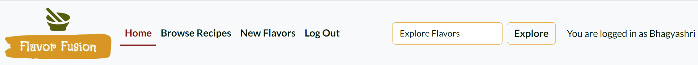

# Flavor Fusion
Flavor Fusion is a web application where food lovers can find, share, and explore recipes. It provides a user-friendly platform that is easy to navigate and visually appealing. Whether you're an experienced cook or just starting, Flavor Fusion lets you discover dishes from around the world, share your own recipes, and connect with other food enthusiasts.

The application provides several key features, including user authentication, full CRUD functionality for managing recipes, and an interactive community experience where users can like, comment on, and share recipes. Administrators also have a special dashboard to manage user content, making sure recipes and comments are appropriate and high-quality.

Flavor Fusion is built using modern web technologies, including HTML, CSS, and Python with the Django framework. The project was developed as a Portfolio Project for the Code Institute's Full Stack Software Development Course, showcasing the integration of front-end and back-end technologies to create a dynamic and user-friendly web application.


Deployed website: [Link to website](https://flavor-fusion-blog-ffbf5a5ef8f9.herokuapp.com/)<br>

---

# Table of Contents

- [Introduction](#introduction)
    - [Project Overview](#project-overview)
    - [Objectives](#objectives)
    - [Developer Goals](#developer-goals)
    - [User Goals](#user-goals)
- [Learning Outcomes and Skill Development](#learning-outcomes-and-skill-development)
- [System Architecture](#system-architecture)
    - [Application Structure](#application-structure)
    - [Backend Logic](#backend-logic)
    - [Programming Paradigms](#programming-paradigms)
- [Agile Development Process](#agile-development-process)
    - [Agile Planning](#agile-planning)
      - [User Stories and Management](#user-stories-and-management)
      - [Milestones Overview](#milestones-overview)
- [Data Modeling and Database Design](#data-modeling-and-database-design)
    - [Entity-Relationship Diagram (ERD)](#entity-relationship-diagram-erd)
    - [Database Schema](#database-schema)
- [Features](#features)
    - [Current Features](#current-features)
    - [Future Features](#future-features)
---

## Introduction

Flavor Fusion is a web application designed for food enthusiasts to discover, share, and explore a wide variety of recipes. The platform offers a simple and user-friendly interface, making it easy for users to engage with the content and connect with other food lovers.

### Project Overview

Flavor Fusion is a Full-Stack application that provides users with a space to find recipes from around the world, share their own culinary creations, and interact with a community of like-minded individuals. The application includes features such as user authentication, full CRUD (Create, Read, Update, Delete) functionality for managing recipes, and an interactive community experience. An admin dashboard is also available for administrators to monitor and manage user-generated content.

*<span style="color: blue;">[Back to Content](#table-of-contents)</span>*   

### Objectives

- Create a platform that allows users to easily browse, share, and discover recipes.
- Build a community where users can interact by liking and commenting on recipes.
- Ensure a smooth user experience with a clean and intuitive interface.
- Provide tools for administrators to manage content and maintain the quality of the platform.

*<span style="color: blue;">[Back to Content](#table-of-contents)</span>*   

### Developer Goals

As developers, the primary goal is to build a robust and scalable web application using the Django framework. This project highlights their skills in Full-Stack development, focusing on:
- **User Authentication:** Implement user authentication and secure account management.
- **CRUD Functionality:** Develop full CRUD functionality for recipe management.
- **Responsive Design:** Create an interactive and responsive user interface using modern web technologies.
- **Admin Dashboard:** Build an admin dashboard for monitoring and managing user content.
- **Scalability and Maintenance:** Ensure the application is scalable and easy to maintain.

*<span style="color: blue;">[Back to Content](#table-of-contents)</span>*   

### User Goals

Flavor Fusion aims to provide a reliable and easy-to-use platform for cooking and sharing recipes. It is designed for food lovers who want a simple and enjoyable way to:
- Find and explore a wide variety of recipes from different cuisines.
- Share their own recipes and culinary creations with others.
- Like and comment on recipes to interact with the community.
- Enjoy a smooth and visually appealing browsing experience.
- Trust that the platform offers high-quality and well-managed content.

*<span style="color: blue;">[Back to Content](#table-of-contents)</span>*   

## Learning Outcomes and Skill Development
The main goal of this project is to improve my web development skills by using the Django framework in a practical setting. The specific learning objectives are:

- **Full-Stack Development:** Learn how to build a complete web application from start to finish.
- **Front-End Skills:** Improve my ability to create a user-friendly and responsive interface.
- **Back-End Development:** Strengthen my skills in managing databases, handling user authentication, and writing server-side code.
- **Agile Methodology:** Use Agile development practices to stay flexible and adapt to feedback and changing needs.
- **Practical Experience:** Gain hands-on experience that will help in future web development projects.

This project is meant to meet the course requirements and help build a strong foundation for future work in web development.

*<span style="color: blue;">[Back to Content](#table-of-contents)</span>*

## System Architecture

### Application Structure
Flavor Fusion is designed using the Model-View-Controller (MVC) pattern, which divides the application into three key components: Model, View, and Controller. This structure helps organize the code, making development and collaboration more manageable.

The frontend is created using HTML, CSS, and JavaScript, with a focus on a mobile-first, responsive design. Bootstrap is utilized for its extensive library of pre-styled components and a responsive grid system, which speeds up development and ensures a smooth user experience on all devices.

The backend is powered by Python and Django. Django handles the backend logic, URL routing, and database interactions, providing a solid and efficient foundation for the application.

For data storage, the project uses a relational database, PostgreSQL, known for its robustness and scalability. The database stores user and recipe information in a structured manner, which optimizes data retrieval and supports complex queries efficiently.

*<span style="color: blue;">[Back to Content](#table-of-contents)</span>*   


### Backend Logic
Flavor Fusion uses models such as `Recipe`, `Comment`, and `CuisineType`. Each `Recipe` is linked to a `CuisineType` and can have multiple Comments. Each `Comment` is tied to a specific `Recipe` and `User`.

Django views handle all the main functions like creating, updating, reading, and deleting recipes and comments. User login and roles are managed using Django's built-in authentication, which keeps the system secure.

The backend also supports features like liking recipes and approving comments. Tools like Cloudinary manage recipe images, and Summernote widgets are used for rich text editing of ingredients and instructions.

This setup ensures a secure, easy-to-use platform for sharing and managing recipes.

*<span style="color: blue;">[Back to Content](#table-of-contents)</span>*   

### Programming Paradigms

The application uses various programming paradigms to achieve its functionality:

**Object-Oriented Programming (OOP):** Models like Recipe and Comment use classes to represent and manage data. Django's views and forms also leverage OOP principles for reusability and organization.

**Functional Programming:** Some views are written as functions to handle specific tasks, processing inputs and returning responses.

**Declarative Programming:** The Django ORM and forms use a declarative style to define data structures and form fields, abstracting away complex query and presentation logic.

**Event-Driven Programming:** The app responds to user actions and requests, such as form submissions and comment postings, using a request-response model.

**MVC Pattern:** Django follows the Model-View-Controller (MVC) pattern, with Models handling data, Views managing user interactions, and Controllers (or view functions) processing requests and responses.

*<span style="color: blue;">[Back to Content](#table-of-contents)</span>*  

## Agile Development Process

### Agile Planning

For this project, I implemented an Agile methodology, organizing the entire process using a GitHub project board. This approach allowed me to manage the development from the initial planning stages to the final deployment. The project was divided into 10 milestones, each representing a key phase of the development process, ensuring that progress was systematic and aligned with the project’s goals.

You can view the full Project Board, complete with all user stories and progress tracking, here: <a href="https://github.com/users/bhagyashriyogeshpatil/projects/2" target="_blank">Github Project board</a>

<details><summary>User Story Template</summary>


</details>

<details><summary>Kanban Board</summary>


</details>

#### **User Stories and Management:**

- **Acceptance Criteria:** Each user story was developed with specific acceptance criteria to ensure clarity and focus. This approach guaranteed that every task met the necessary requirements before being marked as complete.

- **MoSCoW Prioritization:** To manage priorities effectively, features were categorized using the MoSCoW method - 'Must have', 'Should have'and 'Could have'. This prioritization ensured that the core features (MVP) were developed first, with secondary features added if time permitted.

#### **Milestones Overview:** 

1. **GitHub Repository Setup**

- This milestone involves creating the GitHub repository and setting up the README file. It’s about getting the project organized and ready for development.
    - User Story 1: Create GitHub Repository (Must Have)
    - User Story 26: Create README File (Must Have)

2. **Django Project Initialization**

- This step involves creating the initial Django project and configuring the basic settings. It establishes the groundwork for further development.
    - User Story 2: Initialize Django Project (Must Have)

3. **Deployment and Configuration**

- This milestone is about preparing the project for live deployment, including configuring settings, setting up the database, and deploying the project to Heroku.
    - User Story 3: Configure Deployment and Database (Must Have)
    - User Story 27: Final Deployment to Heroku (Must Have)
    - User Story 31: Deployment with Static Files (Must Have)

4. **User Authentication and Account Management**

- This milestone adds user authentication features, allowing secure user registration and login. It also includes styling the authentication pages for a better user experience.
    - User Story 10: Implement Django Allauth for User Registration and Authentication (Must Have)
    - User Story 11: User Registration and Authentication (Must Have)
    - User Story 24: Style Allauth Pages (Could Have)

5. **Basic Project Structure**

- Involves designing the core layout and user interface elements, such as the base template, static files, navigation menu, and footer.
    - User Story 4: Create Base Template (Must Have)
    - User Story 5: Add Static Files and Media (Must Have)
    - User Story 6: Create Navigation Menu (Must Have)  
    - User Story 7: Create Footer (Must Have)
    - User Story 23: Easy Navigation (Must Have)

6. **Website Content and Navigation**

- Focuses on building the main website pages and navigation features, including the home page, recipe browsing, detailed recipe views and explore recipes.
    - User Story 8: Home Page (Must Have)
    - User Story 9: Browse Recipes (Should Have)
    - User Story 16: View Detailed Recipes (Must Have)
    - User Story 21: View Paginated Recipe List (Should Have)
    - User Story 22: Explore Recipes (Should Have)

7. **Recipe Management**

- Implements the functionality for managing recipes, including creating, editing, deleting, and handling draft recipes. This helps maintain the quality and organization of content.
    - User Story 12: Create and Publish Recipes (Must Have)
    - User Story 13: Edit Shared Recipes (Must Have)
    - User Story 14: Delete Recipes (Must Have)
    - User Story 15: Manage Recipe Posts (Must Have)
    - User Story 33: Restrict Draft Recipe Access (Must Have)

8. **Recipe Interaction**

- Adds interactive features for recipes, including commenting, viewing comments, liking recipes, and adding a comment count on recipe details.
    - User Story 17: Comment on Recipes (Should Have)
    - User Story 18: View Comments on Recipe Posts (Should Have)
    - User Story 19: Modify or Delete Comments (Could Have)
    - User Story 20: Approve or Disapprove Comments (Should Have)
    - User Story 25: Interact with Recipe Likes (Could Have)
    - User Story 32: Add Comment Count with Icon on Recipe Detail (Could Have)

9. **Final Touches**

- This milestone focuses on refining the user experience, ensuring easy and intuitive navigation throughout the website. It completes the overall structure and usability of the project.
    - User Story 23: Easy Navigation (Must Have)

10. **Error Handling**

- Ensures the site handles errors effectively with custom error pages and notifications for issues like 403, 404 and 500 errors.
    - User Story 28: Access 403 Error Handling (Should Have)
    - User Story 29: Custom 404 Page for Broken Links (Should Have)
    - User Story 30: Notification of Internal Errors (Should Have)

*<span style="color: blue;">[Back to Content](#table-of-contents)</span>*  

## Data Modeling and Database Design

### Entity-Relationship Diagram (ERD)

The Entity-Relationship Diagram (ERD) provides a visual representation of the database's structure. It helps in planning and illustrating the SQL tables and the relationships between them. The ERD is an essential part of the database design that shows the entities, their attributes, and the types of relationships among the entities.

The ER diagram was created with dbdiagram.io [dbdiagram.io](https://dbdiagram.io/home)
to show how the models in the app are structured and related.


*<span style="color: blue;">[Back to Content](#table-of-contents)</span>*   

### Database Schema

The database schema is designed to efficiently manage and store data related to recipes, comments, and user interactions within the application.

The ER diagram was created with dbdiagram.io [dbdiagram.io](https://dbdiagram.io/home)
to show how the models in the app are structured and related. The Recipe model has all the key fields like title, ingredients, and instructions needed for a complete recipe. This design makes sure the website works well and gives users a great experience.

The ER diagram showcases the relationships between the Recipe model, Comment model, CuisineType model and Django's built-in User model (user_django_built_in_model) as follows:

- **User to Recipe: One-to-Many (1:M)**
    - Each user can create multiple recipes.
    - Each recipe is associated with one user.
- **Recipe to Comment: One-to-Many (1:M)**
    - Each recipe can have multiple comments.
    - Each comment is associated with one recipe.
- **User to Comment: One-to-Many (1:M)**
    - Each user can make multiple comments.
    - Each comment is associated with one user.
- **CuisineType to Recipe: One-to-Many (1:M)**:
    - Each cuisine type can be associated with multiple recipes.
    - Each recipe is associated with one cuisine type.

**Summary of Relationships:**
- **User to Recipe (1:M):**
A user can create multiple recipes, but each recipe is created by one user.
- **Recipe to Comment (1:M):**
A recipe can have multiple comments, but each comment is tied to a single recipe.
- **User to Comment (1:M):**
A user can make multiple comments, but each comment is made by a single user.
- **CuisineType to Recipe (1:M)**:
  A cuisine type can have multiple recipes, but each recipe is associated with only one cuisine type.

These relationships were implemented using ForeignKey fields in the Django models:
- The `Recipe` model includes a `ForeignKey` field (`author`) that references the `User` model to denote the creator of the recipe.
- The `Comment` model includes `ForeignKey` fields (`recipe` and `author`) that reference the `Recipe` and `User` models respectively, indicating the recipe being commented on and the user making the comment.
- The `Recipe` model includes a `ForeignKey` field (`cuisine_type`) that references the `CuisineType` model to denote the type of cuisine for the recipe.

Additionally, a many-to-many relationship is established between the `Recipe` model and the `User` model to facilitate the "likes" feature, where users can like multiple recipes.

The `likes` feature is implemented as a **many-to-many(M:M)** relationship between the `Recipe` and `User` models using Django's `ManyToManyField`. Although Django automatically creates a join table for this, it’s not explicitly shown in the ER diagram.

In the dbdiagram.io code, this relationship is represented directly between the Recipe and user_django_built_in_model tables using the following reference:

```
// The many-to-many relationship between Recipe and user_django_built_in_model for likes

Ref: recipe.id < user_django_built_in_model.id [label: "likes", note: "Many-to-Many relationship"]
```
In the dbdiagram.io code, this relationship is represented by a reference label, though the details may not appear directly in the visual diagram, keeping the design clean and focused.

*<span style="color: blue;">[Back to Content](#table-of-contents)</span>*   

## Features

### Current Features

#### Navigation Menu
The navigation bar adapts based on user login status and is fully responsive for both desktop and mobile devices.

The navigation bar is visible on every page, depending on whether the user is logged in. It adjusts to different screen sizes, turning into a hamburger menu on smaller screens for easy access. When a user logs in or registers, a success message is shown.

- As a developer, I want to create a navigation menu in the base template so that users can easily navigate through the website's pages. **(User Story#6) (must have)**
- As a User, I can navigate between pages easily so that I can explore the website content without any confusion. **(User Story#23) (must have)**

##### **Navigation Bar for All Users (desktop/mobile)**
- Home: Always available.
- Browse Recipes: Accessible to all users.
- Sign Up: Shown to non-authenticated users.
- Log In: Available for non-authenticated users.
- Explore: Search feature available for all users.


##### **Navigation Bar for Authorized Users (desktop/mobile)**
- Home: Always accessible.
- Browse Recipes: Same as for all users.
- New Flavors: Only for logged-in users.
- Log Out: Available for authenticated users.
- Explore: Search feature available for all users.




##### **User Authentication Status**

A message indicating the user's login status is displayed in the nav bar:
- Logged In: "You are logged in as [username]"
- Not Logged In: "You are not logged in"

*<span style="color: blue;">[Back to Content](#table-of-contents)</span>*   

#### Home Page

The home page is designed to be welcoming and informative, clearly showing what the Flavor Fusion website is about. It gives users a preview of what to expect and invites them to explore more. The background image is carefully chosen to match the recipe theme and enhance the site's visual appeal. 

For users who are not logged in, a "Sign Up Now" button is displayed on the home page. This button appears only if the user is not authenticated, encouraging new visitors to sign up for an account.

- As a visitor, I want to see an engaging home page so that I can understand what the recipe blog offers. **(User Story#8) (must have)**

##### Home Page for All Users


##### Home Page for Authorised Users


*<span style="color: blue;">[Back to Content](#table-of-contents)</span>*   

#### Footer
The footer of the Flavor Fusion website provides key information and links for users to connect with the developer.

Like the navigation bar, the footer appears on every page of the website. It includes icons linking to GitHub and LinkedIn. These links let users view my work on GitHub and learn more about me on LinkedIn. Both links open in new tabs.

- As a developer, I want to create a footer so that users can access social media links and see information about the developer and the website creation year at the bottom of every page. **(User Story#7) (must have)**


*<span style="color: blue;">[Back to Content](#table-of-contents)</span>*   

#### Sign Up / Log In / Log Out
The navigation bar allows access to all pages, whether on large or small screens.

Users can easily find and use the sign-up and log-in options to fully explore the website's features. Clear messages are displayed to guide users on whether they need to sign up or log in to view recipes, like, comment, or add New Flavors.

Success messages are shown to users after they sign up, log in, or log out.

- As a developer, I need to set up Django Allauth so that users can register, sign in, and access additional features on the website. **(User Story#10) (must have)**

- As a Site User, I can register an account so that I can access publishing, commenting, and like/unlike features. **(User Story#11) (must have)**

- As a developer, I want to style the allauth authentication pages - signup, login, and logout; so that users have a consistent experience.. **(User Story#24) (could have)**
##### Sign Up Page View


##### Log In Page View


##### Log Out Page View


*<span style="color: blue;">[Back to Content](#table-of-contents)</span>*   

#### New Flavor Page

The New Flavor page allows users to submit a new flavor to the application. The link to this page is only visible to users who are logged in. When clicked, it takes them to a form where they can enter details about the new flavor.

- Required Fields: 
  - All fields, except for the optional image upload, must be filled out.
  - If any required fields are left empty, error messages will appear below those fields.

- Image Upload: 
  - Users can upload an image for the flavor, but it's not required.
  - If no image is provided, a default image will be used.

- Submission and Feedback: 
  - After submitting the form, users will see a success message.
  - They will be redirected to the page displaying all flavors.

- User-Friendly Design: 
  - The form is styled with Crispy Forms and Bootstrap.
  - This makes the form clean and easy to use.

- As a logged-in user, I can share delicious recipes with others so that creating and publishing recipes. **(User Story#12) (must have)**

##### New Flavor Page View


##### New Flavor Page View Mobile


*<span style="color: blue;">[Back to Content](#table-of-contents)</span>*   

#### Edit Flavor

The Edit Flavor page allows logged-in users to update their previously shared recipes. This page ensures that users can correct or modify recipe details as needed.

- Access Control:
    - Only the user who posted the recipe can see and use the "Edit" button.

- Pre-Populated Form:
    - The form is pre-filled with the existing recipe details, making it easy to update.

- Required Fields:
    - All fields, except for the optional image upload, must be filled out. Error messages will appear if any required fields are left empty.

- Image Upload:
    - Users can update the image, but it's not required.

- Submission and Feedback:
    - After clicking "Update Flavor", a confirmation message appears, and the user is redirected to the recipes page.

- User-Friendly Design:
    - The form uses Crispy Forms and Bootstrap for a clean and easy-to-use interface.

This page makes it simple for users to keep their recipes up to date.

- As a logged-in User, I can edit my shared recipes so that I can correct and update recipe details as needed. **(User Story#13) (must have)**

##### Edit Flavor button


##### Edit Flavor Page View


*<span style="color: blue;">[Back to Content](#table-of-contents)</span>*  

#### Delete Flavor

The Delete Flavor feature allows logged-in users to remove recipes they have previously created or shared. This functionality ensures users can manage their content by removing any outdated or unwanted recipes.

- Access Control:
    - The "Delete" button is visible only to the user who authored the recipe.

- Confirmation Page:
    - Users are directed to a confirmation page to verify their intention to delete the recipe.
    - On this page, users can either confirm the deletion or cancel the action.

- Deletion and Feedback:
    - If the user confirms the deletion, the recipe is permanently removed from the site.
    - A success message is displayed, and the user is redirected as appropriate.
    - If the user cancels the deletion, they are taken back to the recipe's detailed page.

- User-Friendly Design:
    - The confirmation page uses Bootstrap for a clean and user-friendly interface, making it easy to navigate and manage recipes.

- As a logged-in user, I can delete my previously created or shared recipes so that they are removed from the site and no longer visible to others. **(User Story#14) (must have)**

##### Delete Flavor Button


##### Confirm Deletion View


*<span style="color: blue;">[Back to Content](#table-of-contents)</span>*   

#### Recipe Details
The Recipe Details page allows users to view all the important information about a specific recipe. This page includes the recipe's title, author, ingredients, preparation and cooking times, and step-by-step instructions. Users can also interact with the recipe by liking it, leaving comments, and, if they are the author, editing or deleting it.

- Recipe Information:
    - Shows the recipe's title and the user who posted it.
    - Displays when the recipe was created.
    - Indicates the type of cuisine.
    - Lists the time needed to prepare and cook the recipe.
    - Shows the number of servings.
    - Provides a brief overview of the recipe.
    - Ingredients and Instructions: Details what you need and how to make the dish.

- Image Display:
    - If an image is uploaded, it will be displayed on the page.
    - A default image is shown if no image is provided.

- User Interactions and Design:
    - Logged-in users can like/unlike recipes, leave, edit, or delete comments, and the recipe's author can edit or delete their recipe. 
    - The page is designed to be responsive, looking good on both desktop and mobile devices.

The Recipe Details page is designed to be simple and user-friendly, providing all the necessary information and interactive options in a clear and accessible way.

- As a Site User, I can view and read detailed recipes shared by others so that I can get inspiration. **(User Story#16) (must have)**

##### Recipe Details View for Unauthorised Users


<details><summary>Recipe Details View for Unauthorised Users Mobile</summary>


</details>

##### Recipe Details View for Logged-in Users


<details><summary>Recipe Details View for Logged-in Users Mobile</summary>


</details>

##### Recipe Details View for Logged-in User and author of the recipe


<details><summary>Recipe Details View for Logged-in Users Mobile</summary>


</details>

*<span style="color: blue;">[Back to Content](#table-of-contents)</span>*   

### Future Features

*<span style="color: blue;">[Back to Content](#table-of-contents)</span>*   