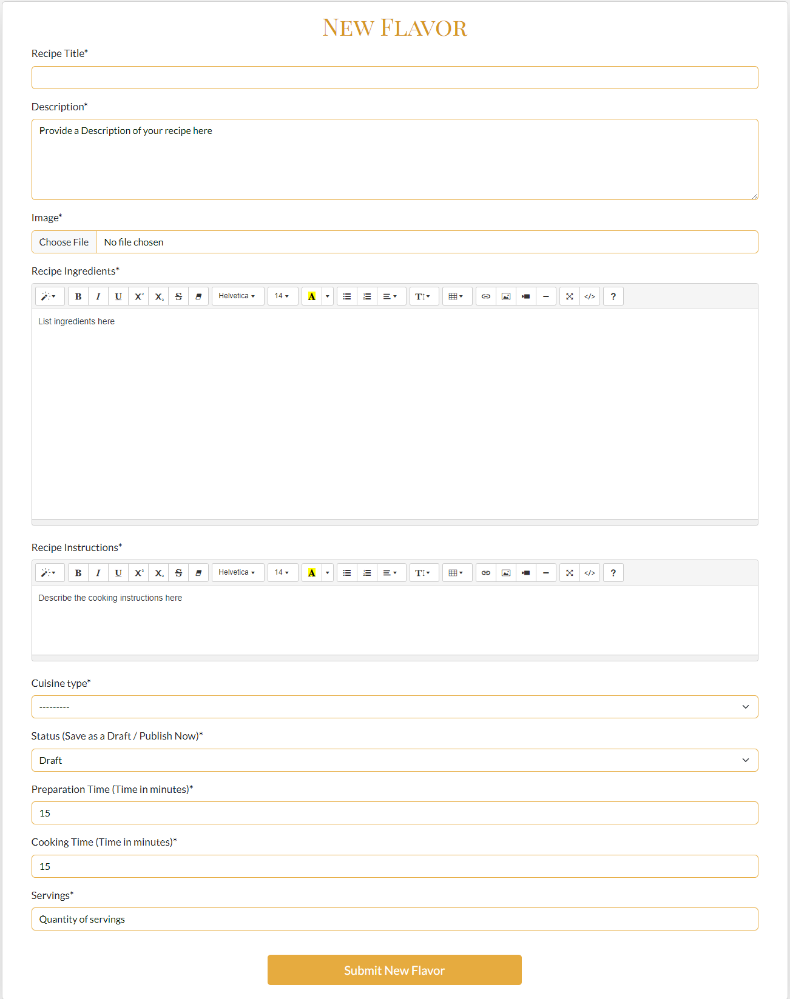

# Testing

Return back to the [README.md](README.md) file.

---

## CONTENT

- [Testing overview & environment](#testing-overview--environment)
    - [Test environment](#test-environment)
    - [Browser compatibility](#browser-compatibility)
    - [Responsiveness](#responsiveness)
- [Automated Testing](#automated-testing)
- [Code Validation](#code-validation)
- [Lighthouse](#lighthouse)
- [Manual test](#manual-test)
    - [Application Functionality Testing](#application-functionality-testing)
    - [Error Handling](#error-handling )
- [Bug Overview](#bug-overview)
    - [Solved Bugs](#solved-bugs)
    - [Unsolved Bugs](#unsolved-bugs)
---
## Testing overview & environment

Testing was ongoing throughout the entire development. I used the various linters and GITPOD terminal output whilst building to pinpoint and troubleshoot any issues as I went along.

### Test environment
The application was tested on various devices to ensure it works well across different platforms:
* Desktop:
  * Dell Inspiron : The application was primarily tested on a Dell Inspiron desktop, ensuring that it functions correctly on standard desktop hardware.

* Screen:
  * OnePlus 9R : Tested on this Android device to verify performance and responsiveness on mid-range smartphones.
  * Apple iPhone 13 : Verified compatibility with Apple's iOS ecosystem, ensuring that the app runs smoothly on an iPhone.
  * Samsung A32 5G: Additional testing was performed on this Android device to ensure the application performs well on higher-end smartphones.


### Browser compatibility
The application was tested on the following browsers to ensure consistent performance:
* Google Chrome
* Firefox
* Microsoft Edge

### Responsiveness

App is fully responsive on breakpoints supported by Bootstrap 5.3.3.

| **Breakpoint** | **Prefix** | **Minimum Width** |
|----------------|------------|-------------------|
| Extra Small    | `xs`       | `< 576px`         |
| Small          | `sm`       | `≥ 576px`         |
| Medium         | `md`       | `≥ 768px`         |
| Large          | `lg`       | `≥ 992px`         |
| Extra Large    | `xl`       | `≥ 1200px`        |
| Extra Extra Large | `xxl`   | `≥ 1400px`        |


*<span style="color: blue;">[Back to Content](#content)</span>*

## Automated Testing

No automatic testing apart from using the pep8 validator was performed.

*<span style="color: blue;">[Back to Content](#content)</span>*

## Code Validation

### HTML Validation

All HTML files were validated using the recommended [HTML W3C Validator](https://validator.w3.org).

To validate pages with Jinja and authentication:

- Log in to the deployed site and navigate to the page.
- Right-click and select "View Page Source" 
- Copy the rendered HTML and paste it into the W3C Validator's "Validate by Direct Input" section.
- Repeat for each page.

#### Home Page


#### Browse Recipes Page


#### Recipe Detail Page


#### New Flavors Page


The errors identified by W3Validator on the "New Flavors Page" are related to Summernote, not my code. According to feedback from the Code Institute community, this is a common issue. Therefore, it should be noted, but no action is needed.

#### Edit Flavors Page


Similarly, the errors on the "Edit Flavors Page" are also linked to Summernote and not my code. The Code Institute community has observed that this is a frequent problem. Therefore, it should be noted, but no action is needed.

#### Recipe Confirm Delete Page


#### Sign Up Page


The HTML code for the Sign Up page is generated by the Django authentication form, which I can't modify. The HTML errors are due to how Django handles allauth's helper text, not because of anything I wrote. Therefore, no changes have been made.

#### Log In Page


#### Log Out Page


#### 403 Error Page


#### 404 Error Page


#### 500 Error Page


### CSS Validation
[CSS Jigsaw Validator](https://jigsaw.w3.org/css-validator) was used to to validate the CSS file.


### Python Validation

The recommended [CI Python Linter](https://pep8ci.herokuapp.com) was used to validate all Python files.


*<span style="color: blue;">[Back to Content](#content)</span>*

## Lighthouse

### Home Page
<details>
  <summary>Home Page - Desktop</summary>
    


</details>

<details>
  <summary>Home Page - Mobile</summary>
    


</details>


### Browse Recipes Page

<details>
  <summary>Browse Recipes Page - Desktop</summary>
    


</details>

<details>
  <summary>Browse Recipes Page - Mobile</summary>


</details>

### New Flavors Page
<details>
  <summary>New Flavors Page - Desktop</summary>
    


</details>

<details>
  <summary>New Flavors Page - Mobile</summary>


</details>

### Edit Flavors Page

<details>
  <summary>Edit Flavors Page - Desktop</summary>
    


</details>

<details>
  <summary>Edit Flavors Page - Mobile</summary>


</details>

### Recipe Confirm Delete Page
<details>
  <summary>Recipe Confirm Delete Page - Desktop</summary>
    


</details>

<details>
  <summary>Recipe Confirm Delete Page - Mobile</summary>


</details>

### Sign Up Page
<details>
  <summary>Sign Up Page - Desktop</summary>
    


</details>

<details>
  <summary>Sign Up Page - Mobile</summary>


</details>

### Log In Page
<details>
  <summary>Log In Page - Desktop</summary>
    


</details>

<details>
  <summary>Log In Page - Mobile</summary>


</details>

### Log Out Page

<details>
  <summary>Log Out Page - Desktop</summary>
    


</details>

<details>
  <summary>Log Out Page - Mobile</summary>


</details>

*<span style="color: blue;">[Back to Content](#content)</span>*

## Manual Test

### Application Functionality Testing

| Page | Feature/Link/Button	| Action	| Expected Result	| Actual Result |
|---|---|---|---|---|
|All Pages- Navigation Bar | Navigation Bar  | View the navigation bar on desktop and mobile  | The navigation bar is visible at the top of every page, adapting to different screen sizes (hamburger menu on mobile)  | Works as expected  |
|All Pages- Navigation Bar | Logo | Verify the logo image and link |	The logo is visible on the navigation bar, links to the home page, and is displayed correctly with the expected image. | Works as expected |
| All Pages - Navigation Bar | "Home" link | Click the link |	Redirects to the Home page | Works as expected |
| Home Page | Background Image |View the home page|The background image is visible and enhances the site's visual appeal, matching the recipe theme|Works as expected|
|Home Page|Welcome Message|View the home page|A welcoming message is prominently displayed, explaining what the Flavor Fusion website is about|Works as expected|
| Home Page | "Sign Up Now" button (when logged out) | View the home page as a non-authenticated user | The "Sign Up Now" button is visible, inviting users who are not logged in to create an account. | Works as expected |
|Home Page|Sign Up Now Button|View the home page as an authenticated user|The "Sign Up Now" button is not displayed for authenticated users|Works as expected|
|Home Page|Navigation Links|Click any available navigation links (e.g., "Browse Recipes")|The user is redirected to the corresponding page (e.g., Browse Recipes) upon clicking.|Works as expected|
|Home Page|Page Responsiveness|Resize browser window to various screen sizes|The home page layout and background image adapt smoothly to different screen sizes, maintaining visual appeal.|Works as expected|
| All Pages - Navigation Bar | "Browse Recipes" link | Click the link | Redirects to the the recipes listing page | Works as expected |
| Browse Recipes Page | Recipe Card | View recipe cards | Each recipe card shows an image, title, brief description, author, cuisine type, posting date, and a "View Recipe" button. |  Works as expected |
| Browse Recipes Page | "View Recipe" Button | Click the "View Recipe" button |  Redirects to the detailed recipe page for the selected recipe. | Works as expected |
| Browse Recipes Page |  Mobile View | Test on a mobile device | The layout adapts, showing recipe cards and pagination controls correctly on smaller screens. | Works as expected |
| Browse Recipes Page |  Default Image|  View a recipe card with no uploaded image | A default placeholder image from Cloudinary is displayed on the recipe card.  | Works as expected |
| Browse Recipes Page |  Desktop View | Test on a desktop device  | The layout adapts, showing recipe cards and pagination controls correctly on larger screens.  | Works as expected |
| Browse Recipes Page |"Previous" button | Click "Previous" link | Navigate to the previous page of recipes | Works as expected |
| Browse Recipes Page | "Next" button | Click "Next" link | Navigate to the next page of recipes | Works as expected |
| Browse Recipes Page | Pagination Behavior | Verify pagination behavior with varying numbers of recipes and pages |Pagination controls should adjust based on the number of recipes and the total number of pages, with 6 recipes displayed per page | Works as expected |
| All Pages - Navigation Bar | "Log In" link (when logged out) | Click the link | Redirects to the Login page | Works as expected |
| All Pages - Navigation Bar | "Log Out" link (when logged in) | Click the link | Logs the user out, displays the "Log Out" confirmation page, and redirects to the Home page with a logout message.| Works as expected |
| Log Out Confirmation Page | Confirm logout on the "Log Out" page | User clicks the "Log Out" button on the confirmation page | User is logged out and redirected to the Home page with a logout success message displayed | Works as expected |
| All Pages - Navigation Bar | "Explore" link | Click the link | User is taken to the Browse Recipes page where they can search for recipes. All available recipes are shown by default. | Works as expected |
| Explore Flavors Feature | Perform a search using the search bar | Enter keywords (e.g., title, description, author, or cuisine type) in the search bar and press Enter. | Matching recipes are displayed in a list. If no match is found, a "No results found" message is displayed | Works as expected |
| Explore Flavors Feature | Empty search query | Do not enter anything in the search bar and press Enter | All available (Published) recipes are displayed | Works as expected |
| Explore Flavors Feature | Search with a keyword related to a Draft recipe |Enter a keyword related to a recipe that is in Draft status and press Enter |The Draft recipe should not appear in the search results | Works as expected |
| Navigation Bar| "New Flavor" link | Logged-in user clicks the "New Flavor" link |User is taken to the New Flavor page with a form to submit a new recipe | Works as expected |
| New Flavor Page | "Submit New Flavor" button | Submit the form with all required fields filled out | The form is submitted successfully, and the user is redirected to the page displaying all flavors with a success message shown | Works as expected |
| New Flavor Page | "Submit New Flavor" button | Submit the form with required fields left empty | Error messages appear below each required field that was left empty, and the form is not submitted | Works as expected |
| New Flavor Page | "Submit New Flavor" button | Submit the form without uploading an image |The form is submitted successfully with a default image assigned to the new flavor | Works as expected |
| New Flavor Page | "Submit New Flavor" button | Submit the form with an uploaded image | The form is submitted successfully, and the new flavor is displayed with the uploaded image | Works as expected |
| New Flavor Page | Form elements | Review the styling and usability of the form | The form should be clean and easy to use, styled with Crispy Forms and Bootstrap for a user-friendly experience | Works as expected |
| Recipe Detail Page | Page Elements (Title, Author, etc.) | Navigate to a recipe's detail page and inspect the page elements | The page should display the recipe’s title, author, creation date, cuisine type, preparation and cooking times, servings, overview, ingredients, instructions, and image (or default image if none is provided) | Works as expected |
| Recipe Detail Page | "Edit" button (for recipes owned by the user, including drafts) | Click the button |Redirects to the Edit Recipe page with the form pre-populated with existing details| Works as expected |
| Edit Flavor Page | Pre-populated Form | Verify that the form fields are pre-filled with existing recipe details | The form fields should display the current details of the recipe, including title, ingredients, instructions, etc. | Works as expected |
| Edit Flavor Page | Required Fields | Leave one or more required fields empty and attempt to submit the form | Error messages should appear below the empty fields, indicating that the required fields must be filled out | Works as expected |
| Edit Flavor Page | Image Upload | Upload a new image or leave the image upload field blank and submit | If a new image is uploaded, it should replace the old one. If no image is uploaded, the existing image should remain | Works as expected |
| Edit Flavor Page | "Update Flavor" button | Click the "Update Flavor" button |A confirmation message should appear indicating that the recipe has been updated, and the user should be redirected to the recipes page | Works as expected |
| Recipe Detail Page |"Delete" button (for recipes owned by the user, including drafts)| Click the button | Prompts for confirmation and deletes the recipe upon confirmation, with feedback provided | Works as expected |
| Delete Confirmation Page | "Confirm" button | Click the "Confirm" button on the confirmation page |The recipe is permanently removed from the site, a success message is displayed, and the user is redirected to an appropriate page (e.g., the recipes list) | Works as expected |
| Delete Confirmation Page | "Cancel" button | Click the "Cancel" button on the confirmation page | The user is redirected back to the recipe’s detail page, and no changes are made to the recipe | Works as expected |
| Recipe Detail Page | Like/Unlike Button (Heart Icon) | Click the heart icon for a logged-in user; check for both liked and unliked states | For a logged-in user, clicking an empty heart icon should fill it and increase the like count. Clicking a filled heart icon should empty it and decrease the like count. Non-logged-in users should see a disabled icon. | Works as expected |
| Recipe Detail Page | Like Button (Non-logged-in User) | Inspect the heart icon for a non-logged-in user | The heart icon should be disabled and unclickable for non-logged-in users | Works as expected |
| Recipe Detail Page | Comments Section | Verify the presence and functionality of the comments section | The comments section should be visible if there are comments. If no comments are present, a message encouraging users to comment should be displayed. Comments should be displayed with an approval message if pending. | Works as expected |
| Recipe Detail Page - Comments Section | Comment Field | Attempt to submit a comment while logged in | The comment should be submitted and appear with a notification that it is awaiting approval. Comments should be visible after approval | Works as expected |
| Recipe Detail Page - Comments Section | Edit/Delete Comment (loged-in User) | Edit or delete a comment if it was posted by the logged-in user |The comment should be edited or deleted as requested, with changes reflected immediately on the page | Works as expected |
| Recipe Detail Page - Comments Section | Admin Approval Interface | Log in as an admin and review the comments awaiting approval |Admins should be able to approve or disapprove comments. Approved comments should appear on the recipe page; disapproved comments should not. | Works as expected |
| Recipe Detail Page - Comments Section | Comment Icon and Count | Verify that the comment icon and count are correctly displayed next to the liked count | The comment icon should be visible, and the count should accurately reflect the number of comments on the recipe | Works as expected |
|All Pages - Footer|Footer Display|View the footer on any page|The footer is visible at the bottom of every page on the website.| Works as expected |
|All Pages - Footer|GitHub Icon|Click the GitHub icon|The GitHub profile opens in a new tab| Works as expected |
|All Pages - Footer|LinkedIn Icon|Click the LinkedIn icon|The LinkedIn profile opens in a new tab| Works as expected |
|All Pages - Footer|Mobile View|View the footer on a mobile device|The footer is responsive, displaying the icons and information correctly on smaller screens| Works as expected |
|All Pages - Footer|Desktop View|View the footer on a desktop device|The footer displays correctly at the bottom of the page on larger screens.| Works as expected |
|All Pages - Footer|Website Info|View the footer text|The footer includes text with developer information and the website creation year| Works as expected |

*<span style="color: blue;">[Back to Content](#content)</span>*

### Error Handling 

| Feature	| Action	| Expected Result	| Actual Result |
|---|---|---|---|
|403 Forbidden Error|Attempt to access a restricted page (e.g., Edit/Delete page of another user's recipe)|A custom 403 error page is displayed|Works as expected|
|403 Forbidden Error (Draft Recipe)|Attempt to view another user's draft recipe|A custom 403 error page is displayed|Works as expected|
|404 Page Not Found Error|Enter a non-existent URL or follow a broken link|A custom 404 error page is displayed|Works as expected|
|500 Error (Internal Server)|Visit http://localhost:8000/test-500/ to trigger the 500 error by accessing the trigger_500_error view.|A custom 500 error page should be displayed with a user-friendly message indicating a server issue.|Works as expected|
|Invalid Login Attempt|Try to log in with incorrect credentials|An error message "The username and/or password you specified are not correct." is displayed on the login page|Works as expected|
|Failed Form Submission|Submit a form with missing required fields|Error messages are shown next to the relevant form fields, and the form is not submitted|Works as expected|
|Unauthorized Comment Edit/Delete|Try to edit or delete another user's comment|A custom 403 error page is displayed|Works as expected|

*<span style="color: blue;">[Back to Content](#content)</span>*

## Bug Overview

### Solved Bugs

**1.** LinkedIn Page Link Not Accessible

  - **Issue:** The LinkedIn link in the footer was leading to a "Page not found 404" error.
  - **Fix:** Added https:// to the LinkedIn URL in the footer, ensuring the link directs correctly to the LinkedIn page.

**2.** Hero Background Image Not Visible After Deployment
  - **Issue:** The hero background image on the home page, hosted on Cloudinary, was not displaying after deploying the site on Heroku.
  - **Fix:** Resolved the issue by running the collectstatic command in the terminal and adding the CLOUDINARY_URL to the Reveal Config Vars in Heroku.

**3.** Forbidden 403 CSRF Verification Error
  - **Issue:** Encountered a "Forbidden 403 CSRF Verification" error when accessing the site after deploying on Heroku.
  - **Fix:** Added the CSRF_TRUSTED_ORIGINS field to settings.py to include the necessary domains. The following lines were added to resolve the issue:
  ```python
  CSRF_TRUSTED_ORIGINS = [
    "https://*.codeinstitute-ide.net",
    "https://*.herokuapp.com"
  ]
  ```
  - Resolved the issue based on guidance from [Stack Overflow](https://stackoverflow.com/questions/12174040/forbidden-403-csrf-verification-failed-request-aborted)

**4.** Invalid filter: 'crispy'
  - **Issue:** The error Invalid filter: 'crispy' suggests that Django Crispy Forms may not be properly installed or configured.
  - **Fix:** 
    - Installed Django Crispy Forms using pip : `pip install django-crispy-forms `.
    - Added crispy_forms to INSTALLED_APPS in settings.py: 
      ```
      INSTALLED_APPS = [
        ...
        'crispy_forms',
        ]
      ```
    - Specified the template pack to be used by Crispy Forms in settings.py : 
      `CRISPY_TEMPLATE_PACK = 'bootstrap5'`
    - Ensured that the `` statement is included at the top of your HTML templates where Crispy Forms is used

**5.** Slug Field Not Auto-Populated in Admin Panel
  - **Issue:** The slug field in the admin panel wasn’t automatically filled in based on the title, which caused errors like "duplicate key value violates unique constraint."
    - IntegrityError occurred when attempting to save a new recipe with a non-unique slug value.
  - **Fix:** This bug occurs when the slug field is empty or not unique, resulting in a conflict when saving new or existing recipes.
    - To fix this, I imported 'slugify' from 'django.template.defaultfilters'.
    - I then overrode the save method in the Recipe model to ensure slugs are unique:
      ```python
      from django.template.defaultfilters import slugify

      def save(self, *args, **kwargs):
        self.slug = slugify(self.title)
        super().save(*args, **kwargs)
      ```
  - Resolved the issue based on guidance from [Stack Overflow](https://stackoverflow.com/questions/31162620/django-slugs-key-slug-is-duplicated)

**6.** Success Message Not Displayed After Recipe Deletion
  - **Issue:** The success message did not show up after a recipe was deleted. This was because the 'DeleteRecipe' view used a static URL for 'success_url' and had issues with handling success messages.
  - **Fix:**
      - Changed the static URL to use reverse_lazy, which dynamically finds the URL based on its name.
      ```python
        from django.urls import reverse_lazy

        success_url = reverse_lazy('recipe_list')
      ```
      - Adjusted the view to correctly display success messages after deleting a recipe.
      - Added settings to style success messages with Bootstrap alert classes in settings.py.
      ```python
        from django.contrib.messages import constants as messages

        MESSAGE_TAGS = {
            messages.DEBUG: 'alert-secondary',
            messages.INFO: 'alert-info',
            messages.SUCCESS: 'alert-success',
            messages.WARNING: 'alert-warning',
            messages.ERROR: 'alert-danger',
        }
      ```

**7.** 500 Error When Updating Recipe Image on Heroku
  - **Issue:** The app shows a 500 Internal Server Error on Heroku when updating a recipe with a new image, even though it works fine locally. This is due to an issue with Cloudinary image handling.
  - **Fix:** The `CLOUDINARY_URL` on Heroku was incorrect. I replaced it with the correct value to fix the issue.

**8.** Incorrect Field Used for Filtering Recipes
  - **Issue:** The RecipesList view attempted to filter recipes using cuisines_type__icontains=query, but this field does not exist in the Recipe model.
  - **Fix:** Changed `cuisines_type__icontains=query` to `cuisine_type__name__icontains=query` to properly filter recipes by the name of the cuisine type.

**9.** Filtering on ForeignKey Field Using icontains
  - **Issue:** Attempting to use icontains on a ForeignKey field raised an error, as icontains is not supported for ForeignKey lookups.
  - **Fix:** Replaced `author__icontains=query` with `author__username__icontains=author_query` to correctly filter by the author's username.

**10.** NoReverseMatch Error for Login URL
  - **Issue:** The NoReverseMatch error occurred because the login view was referenced with ``, but Django Allauth provides the login view under the account namespace.
  - **Fix:** Replaced `` with `` in the 'recipe-details.html' template to correctly link to the login page provided by Django Allauth.

*<span style="color: blue;">[Back to Content](#content)</span>*

### Unsolved Bugs

**1.** Image Field Not Showing Previously Uploaded Image
- When editing a recipe in the "Edit Flavor" page, the image field (featured_image) does not display the currently uploaded image. Instead, it only shows a "Choose File" button, and there is no indication of the existing image.
  - The image field in the Recipe model uses Cloudinary for handling image uploads.
  - The form used for editing (NewFlavorsForm) includes the featured_image field.
  - In the template (edit_recipe.html), the form is rendered using Crispy Forms, but the previously uploaded image is not displayed.
  - Proper Functioning of the Edit Flavor Page:
    - The "Edit Flavor" page correctly renders the form for editing a recipe. The form includes fields for updating the recipe's title, description, ingredients, instructions, and more.
    - When uploading a new image, the form allows file selection and proper handling of the new image with Cloudinary.
    - After successfully updating a recipe, a success message is displayed confirming the update.
  - Expected Behavior: 
    - Users should be able to edit all recipe details, including uploading a new image. The previously uploaded image should be visible or replaced as needed.

    

**2.** Custom Styles Not Applying to Ingredients and Instructions Fields

- Custom CSS styles are not applying to the ingredients and instructions fields on both the "Edit Flavor" "New Flavor" pages. These fields use the SummernoteWidget, which renders a rich text editor, and custom styles are not being reflected as expected.
  - The SummernoteWidget is used for ingredients and instructions fields in the NewFlavorsForm form.
  - Custom CSS has been applied to other fields, but not to these Summernote editors.
  - Attempts to apply custom CSS to the Summernote editors have not resulted in any visible changes.
  - The SummernoteWidget might be applying its own styles or overriding the custom CSS due to specificity or inline styles.
  - Attempts to apply custom styles, including the use of !important declarations, have been unsuccessful.

    

*<span style="color: blue;">[Back to Content](#content)</span>*